# Experimentos — Ejercicio 2

Registro de cada experimento: arquitectura, justificación, resultados y qué se decide cambiar para el siguiente. Las decisiones de diseño más generales (split, encoding de features, por qué Encoder-only, por qué fusión tardía) están en [`Notas.md`](Notas.md) — acá solo se repite lo que hace falta para justificar la config concreta de cada corrida.

Convención: cómputo en `experiments/train.py`/`experiments/model.py`/`experiments/run_experiment<n>.py` (guardan CSV crudo en `output/`), gráficos en `plots/plot_experiment.py` (lee esos CSV, nunca reentrena) — ver regla de separación cómputo/gráficos en el `CLAUDE.md` del TP.

## Experimento 1 — Transformer de texto puro, config mínima

### Alcance

Predecir `bought` usando **únicamente** `title`+`description` (tokenizados, ver `ejercicio1/Notas.md`) a través de un Transformer Encoder-only. Sin features tabulares todavía — decisión explícita del equipo para aislar el comportamiento del Transformer antes de complicar la arquitectura con la fusión (eso queda para un experimento posterior, no es este).

### Arquitectura ([`model.py`](experiments/model.py))

| Pieza | Valor | Por qué |
|---|---|---|
| Embedding | `d_model=16` | Bien por debajo de 100 (sugerencia de la consigna) y del vocabulario (412 tokens: 410 palabras + `<PAD>` + `<UNK>`) — fuerza al modelo a comprimir agresivamente y probar si la atención sola alcanza a encontrar señal (ej. el tag de reputación en `title` identificado en el EDA de `ejercicio1`) sin apoyo tabular. |
| `n_heads` | 1 | El mínimo que sigue siendo "multi-head attention" (con 1 head es self-attention simple). Se deja explícitamente afuera de este experimento para que 2/4/8 heads sea la variable a aislar en el próximo. |
| `n_layers` (encoders apilados) | 1 | Un solo bloque Encoder — self-attention + residual + LayerNorm, MLP feed-forward + residual + LayerNorm (`nn.TransformerEncoderLayer` de PyTorch, sin nada hecho a mano). Es la unidad más chica que la clase define como "Encoder"; apilar más queda para otro experimento. |
| `dim_feedforward` | 64 | Sigue la proporción ~4x `d_model` del paper original (512/128≈4x) pero en una escala mucho más chica. También queda como dial para variar después. |
| Positional encoding | Senoidal | La que se explica en el material de cátedra (Clase 1) para el Transformer original. La profesora nombra explícitamente "qué positional encoding pruebo" como un dial de ablación (`consigna.VTT`) — comparar contra otra variante queda pendiente, no se decide acá. |
| Pooling de salida | Mean-pooling sobre tokens no-pad | **Chequeado contra el material y no está enseñado tal cual** (ni `[CLS]` ni mean-pooling aparecen como técnica de pooling para clasificación en `transformers.VTT`/`embeddings_*.VTT`). Se optó por mean-pooling porque se apoya en algo que sí se explicó: Marina describe la atención misma como "un promedio ponderado" de tokens (`embeddings_1.VTT`, ~L889-930) — mean-pooling es el caso de pesos uniformes de esa misma idea. `[CLS]` en cambio solo aparece atado a cómo se arma el input de pre-entrenamiento de BERT (NSP+MLM, `embeddings_2.VTT` ~L1229), no a "usar su embedding para clasificar" — eso hubiese sido importar una convención de uso de BERT no explicada en clase. Además, mean-pooling no requiere tocar el vocabulario/tokenización ya cerrado de `ejercicio1`. |
| Cabeza de salida | `Linear(16 → 1)` directo | Sin MLP intermedio — el pooled vector va directo a la predicción, la versión más mínima posible. Si hace falta más capacidad ahí es un cambio a probar más adelante. |
| Dropout | 0.1 | Regularización liviana estándar, no es un dial que interese variar por ahora. |
| Parámetros totales | 9.889 | Confirma que el modelo es efectivamente chico. |

### Configuración de entrenamiento ([`train.py`](experiments/train.py), [`run_experiment1.py`](experiments/run_experiment1.py))

Adam (`lr=1e-3`), `batch_size=128`, 20 épocas, **3 semillas (0, 1, 2)** promediadas — según la aclaración de `consigna.VTT` de no reportar una sola corrida. Métricas evaluadas sobre train (en modo eval, sin dropout) y valid en cada época, para poder comparar ambas curvas y diagnosticar over/underfitting (test no se toca, ver `Notas.md`). Sin threshold (PR-AUC/ROC-AUC), según lo indicado en la consigna.

### Resultados

Mejor época de cada semilla (`output/experiment1_results.csv`):

| seed | best_epoch | valid PR-AUC | valid ROC-AUC | train PR-AUC | gap PR-AUC (train-valid) |
|---|---|---|---|---|---|
| 0 | 19 | 0,660 | 0,940 | 0,775 | 0,114 |
| 1 | 15 | 0,706 | 0,962 | 0,730 | 0,024 |
| 2 | 18 | 0,697 | 0,960 | 0,734 | 0,037 |
| **media ± std** | — | **0,688 ± 0,024** | **0,954 ± 0,012** | — | **0,058 ± 0,049** |

Curvas de entrenamiento (media ± desvío sobre las 3 semillas), `output/experiment1_curves.png`:

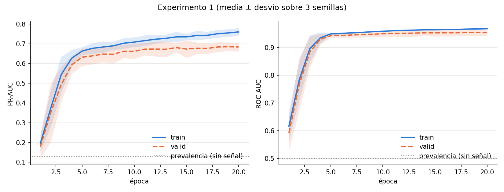

### Análisis

- **Hay señal fuerte en el texto solo.** PR-AUC de valid (0,688) está muy por encima de 0,130 (la prevalencia de `bought` — lo que daría un clasificador que ignora completamente el input) y ROC-AUC (0,954) muy por encima de 0,5. Esto confirma con evidencia empírica la hipótesis de `ejercicio1`: el tag de reputación embebido en `title` (y en general el contenido de `title`/`description`) es predictivo del comportamiento de compra, y el Transformer lo está aprovechando incluso sin ninguna feature tabular.
- **Hay overfitting leve, pero desigual entre semillas.** El gap de PR-AUC train-valid en la mejor época varía mucho (0,114 en seed 0 vs. 0,024-0,037 en seeds 1 y 2) — el desvío del gap (0,049) es casi tan grande como su media (0,058). En el gráfico de PR-AUC se ve que las curvas de train y valid se separan de forma sostenida a partir de la época ~5, mientras que en ROC-AUC casi no hay separación visible. Esto es consistente con que ROC-AUC es menos sensible al desbalance de clases (13% positivos) que PR-AUC — reafirma la decisión de `Notas.md` de priorizar PR-AUC como métrica de diagnóstico principal.
- **No hay una época de corte clara.** La mejor época de valid varía por semilla (19, 15, 18) sin un plateau limpio — con este dataset chico (7012 filas de train) y un modelo de ~10K parámetros, 20 épocas ya alcanzan para empezar a sobreajustar en al menos una semilla.
- El modelo es chico a propósito (9.889 parámetros) — cumple con "arrancar chico" antes de escalar `d_model`/heads/layers.

### Qué cambió respecto al Experimento 1

Se subió **`n_heads` de 1 a 2**, manteniendo todo lo demás igual (`d_model=16`, `n_layers=1`, `dim_feedforward=64`, mismo pooling/positional encoding/cabeza de salida) — para aislar el efecto de multi-head attention de forma controlada, sin mezclarlo con un cambio de capacidad (`d_model`) o de profundidad (`n_layers`).

## Experimento 2 — `n_heads`: 1 → 2

### Arquitectura ([`model.py`](experiments/model.py))

Idéntica a la del Experimento 1 (ver tabla arriba) salvo `n_heads=2`. Con `d_model=16`, esto reparte la atención en 2 subespacios de 8 dimensiones cada uno en vez de uno solo de 16 — la pregunta que responde este experimento es si separar distintos "tipos" de relación entre palabras (ej. el patrón del tag de reputación vs. el resto del texto) ayuda a capturar mejor la señal, o si con un texto tan corto (`MAX_LEN=45`, vocabulario de 410 palabras) un único head ya alcanza.

**Dato relevante para la ablación**: el conteo de parámetros no cambió (9.889, igual que el Experimento 1). Esto es esperable, no un error: las proyecciones Q/K/V/salida de la atención tienen tamaño `d_model × d_model` sin importar en cuántos heads se reparta esa dimensión — heads no es un dial que agregue parámetros, es un dial que **reparte** la misma capacidad ya existente. Es una distinción importante para poder explicar la arquitectura en la presentación.

### Configuración de entrenamiento

Misma que el Experimento 1: Adam (`lr=1e-3`), `batch_size=128`, 20 épocas, 3 semillas (0, 1, 2).

### Resultados

Mejor época de cada semilla (`output/experiment2_results.csv`):

| seed | best_epoch | valid PR-AUC | valid ROC-AUC | train PR-AUC | gap PR-AUC (train-valid) |
|---|---|---|---|---|---|
| 0 | 20 | 0,695 | 0,952 | 0,793 | 0,098 |
| 1 | 20 | 0,689 | 0,959 | 0,769 | 0,080 |
| 2 | 19 | 0,680 | 0,960 | 0,749 | 0,069 |
| **media ± std** | — | **0,688 ± 0,007** | **0,957 ± 0,004** | — | **0,082 ± 0,015** |

Comparación directa contra el Experimento 1:

| | Exp. 1 (`n_heads=1`) | Exp. 2 (`n_heads=2`) |
|---|---|---|
| valid PR-AUC (media ± std) | 0,688 ± 0,024 | 0,688 ± 0,007 |
| valid ROC-AUC (media ± std) | 0,954 ± 0,012 | 0,957 ± 0,004 |
| gap PR-AUC (media ± std) | 0,058 ± 0,049 | 0,082 ± 0,015 |

Curvas de entrenamiento, `output/experiment2_curves.png`:

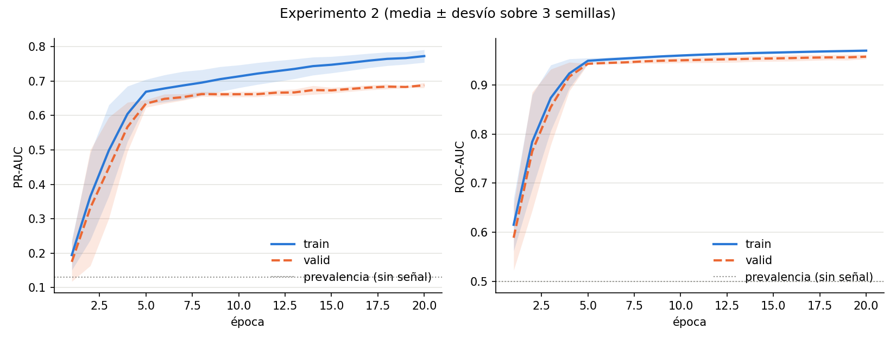

### Análisis

- **La performance pico no cambió.** PR-AUC de valid queda prácticamente idéntico (0,688 en ambos experimentos) y ROC-AUC sube apenas 0,003 (dentro del ruido). Con `d_model=16` en un texto corto, repartir la atención en 2 heads de 8 dimensiones en vez de 1 de 16 no le agregó capacidad predictiva al modelo — coherente con que heads no suma parámetros, solo reparte los que ya había.
- **Lo que sí cambió es la estabilidad entre semillas.** El desvío estándar de PR-AUC bajó de 0,024 a 0,007, y el de ROC-AUC de 0,012 a 0,004 — con 2 heads, las 3 corridas convergen a resultados mucho más parecidos entre sí. En el Experimento 1 una sola semilla (seed 0) se alejaba bastante del resto (gap de 0,114 vs. 0,02-0,04 en las otras dos); acá las 3 semillas quedan agrupadas en gaps de 0,07-0,10. Una hipótesis razonable: con un solo head, la inicialización aleatoria de esos mismos 16×16 parámetros puede caer en soluciones más o menos afortunadas de cómo repartir la atención; con 2 heads, forzar de entrada una partición en subespacios más chicos reduce esa variabilidad entre semillas (aunque esto queda como hipótesis a confirmar, no una conclusión cerrada con solo 3 semillas).
- **El overfitting es levemente peor en promedio (0,058 → 0,082), pero mucho más consistente.** Ya no hay una semilla que se dispare sola (std del gap bajó de 0,049 a 0,015) — las 3 corridas ahora sobreajustan de forma pareja. Esto sugiere que el gap de overfitting depende más de la inicialización/semilla que de si hay 1 o 2 heads en este rango tan chico de `d_model`.
- **Conclusión de este dial**: en esta configuración (`d_model=16`, texto corto), `n_heads` no es el cuello de botella de performance — es más un dial de estabilidad de entrenamiento que de capacidad. Los próximos dials a probar (`n_layers`, `d_model`) son candidatos más prometedores para mover el PR-AUC pico.

### Qué cambió respecto al Experimento 1

Se barrieron varios valores de **`n_layers`** (encoders apilados) en una sola tanda, en vez de probar un valor por experimento, para acelerar la iteración: **2, 4 y 8** (valores que la profesora menciona explícitamente en `transformers.VTT` — "apilan N encoders... paper original 6; prueban 2/4/8 también"), más el valor **1** reusado sin reentrenar del Experimento 1 como referencia. El resto de la arquitectura queda fijo en la base del Experimento 1 (`n_heads=1`, `d_model=16`, `dim_feedforward=64`).

**Cambio de metodología a partir de acá**: pedido explícito de correr varios valores y quedarse con el mejor, en vez de aislar cada dial contra la base fija del Experimento 1 uno por uno. A partir del Experimento 4, cada nuevo dial se prueba sobre **la mejor configuración encontrada hasta el momento** (búsqueda greedy / coordinate-ascent: se fija lo ya decidido y se optimiza el siguiente dial), no contra la base original en paralelo. Esto es más rápido y da directamente una arquitectura final, a costa de que los dials ya no quedan perfectamente aislados entre sí (ej. si el mejor `d_model` resultara distinto partiendo de `n_layers=1` en vez de `n_layers=2`, no lo vamos a ver) — trade-off consciente entre rigurosidad del estudio de ablación y tiempo disponible, a explicar así en la presentación.

## Experimento 3 — barrido de `n_layers`: 1 (Exp. 1) / 2 / 4 / 8

### Arquitectura ([`model.py`](experiments/model.py))

Igual que el Experimento 1 salvo `n_layers` variable. Apilar encoders es distinto de agregar heads: cada capa nueva agrega un set completo de proyecciones Q/K/V/salida + feed-forward propio (no reparte parámetros existentes, los suma) — por eso acá sí se espera que cambie tanto la capacidad como el riesgo de overfitting, a diferencia de lo que se vio con `n_heads` en el Experimento 2.

### Configuración de entrenamiento

Misma que los experimentos anteriores: Adam (`lr=1e-3`), `batch_size=128`, 20 épocas, 3 semillas (0, 1, 2) por valor de `n_layers`.

### Resultados

Media ± std sobre 3 semillas, por valor de `n_layers` (`output/experiment3_results.csv`):

| `n_layers` | n_params | valid PR-AUC | valid ROC-AUC | gap PR-AUC |
|---|---|---|---|---|
| 1 (Exp. 1) | 9.889 | 0,688 ± 0,024 | 0,954 ± 0,012 | 0,058 ± 0,049 |
| **2** | 13.169 | **0,696 ± 0,018** | 0,953 ± 0,012 | **0,028 ± 0,042** |
| 4 | 19.729 | 0,651 ± 0,025 | 0,950 ± 0,006 | 0,065 ± 0,032 |
| 8 | 32.849 | 0,650 ± 0,053 | 0,947 ± 0,009 | 0,055 ± 0,035 |

Barrido completo, `output/experiment3_sweep.png` (círculo = mejor valor por PR-AUC de valid):

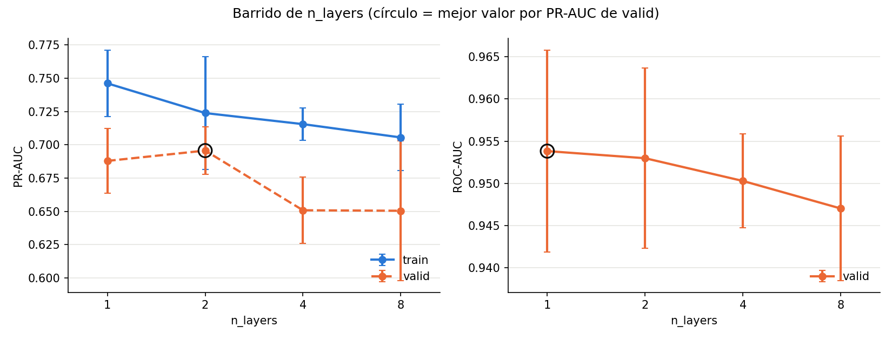

### Análisis

- **`n_layers=2` gana en PR-AUC de valid** (0,696, contra 0,688 de la base) **y además generaliza mejor**: tiene el gap de overfitting más chico de los 4 valores probados (0,028, la mitad que la base). No es solo "el mejor número" — es una mejora consistente en dos frentes a la vez, lo cual la hace una elección sólida.
- **Matiz**: en ROC-AUC, `n_layers=1` queda apenas arriba (0,954 vs. 0,953) — diferencia mínima, dentro del solapamiento de los desvíos estándar. No contradice la elección de `n_layers=2` (PR-AUC sigue siendo la métrica de diagnóstico principal por el desbalance de clases, ver discusión de `Notas.md`), pero vale aclararlo: no es que `n_layers=2` gane en todo, gana en la métrica que más importa acá.
- **Más profundidad no ayudó — de hecho, empeoró.** Con `n_layers=4` y `8` tanto PR-AUC como ROC-AUC bajan de forma monótona, y la variabilidad entre semillas crece fuerte en `n_layers=8` (std de PR-AUC 0,053, más del doble que en `n_layers=2`). Con un dataset chico (7.012 filas de train) y secuencias cortas (`MAX_LEN=45`), apilar más encoders agrega parámetros (hasta 32.849 en `n_layers=8`, 3,3x la base) sin que haya más señal para aprovecharlos — el resultado es un modelo más difícil de optimizar de forma estable en pocas épocas, no uno con más capacidad útil.
- **Conclusión de este dial**: `n_layers=2` queda como la configuración ganadora. A partir de acá, la arquitectura base para seguir ablacionando es `n_heads=1`, `n_layers=2`, `d_model=16`, `dim_feedforward=64`.

### Qué cambió respecto al Experimento 3

Con `n_heads` (Exp. 2, sin efecto en el pico) y `n_layers` (Exp. 3, ganador `n_layers=2`) ya explorados, quedan los dos dials de capacidad: **`d_model`** (ancho del stream que atraviesa todo el bloque -- embeddings, Q/K/V, entrada/salida de cada sub-capa) y **`dim_feedforward`** (ancho interno del MLP posicional de cada encoder, ver discusión de por qué están relacionados más abajo). Se corrieron **por separado** (Experimento 4: solo `d_model`; Experimento 5: solo `dim_feedforward`) para no mezclar sus efectos, con el plan de recién combinarlos en un tercer experimento si la evidencia lo pide -- ver el análisis conjunto al final.

Base fija para ambos (la ganadora del Experimento 3): `n_heads=1`, `n_layers=2`.

## Experimento 4 — barrido de `d_model`: 8 / 16 (Exp. 3) / 32 / 64 / 128 / 256

`dim_feedforward=64` fijo (el valor de la base). Primera tanda: 8, 32, 64, dentro del límite `<100` que sugiere la consigna. **Segunda tanda (128, 256)**: se extendió el barrido más allá de 100 porque la primera tanda no mostraba meseta -- "arranquen con `d_model<100`" es una sugerencia de punto de partida, no un techo (la clase lo aclara explícitamente: "de última después van aumentando", `consigna.VTT`), así que correspondía seguir el barrido para encontrar dónde está realmente el techo de este dial en vez de frenar en el límite sugerido para arrancar.

Media ± std sobre 3 semillas (`output/experiment4_results.csv`):

| `d_model` | n_params | valid PR-AUC | valid ROC-AUC | gap PR-AUC |
|---|---|---|---|---|
| 8 | 6.137 | 0,665 ± 0,016 | 0,947 ± 0,003 | 0,004 ± 0,039 |
| 16 (Exp. 3) | 13.169 | 0,696 ± 0,018 | 0,953 ± 0,011 | 0,028 ± 0,042 |
| 32 | 30.305 | 0,710 ± 0,022 | **0,964 ± 0,001** | 0,044 ± 0,047 |
| **64** | 76.865 | **0,724 ± 0,021** | 0,962 ± 0,004 | 0,012 ± 0,014 |
| 128 | 219.137 | 0,718 ± 0,031 | 0,962 ± 0,004 | 0,081 ± 0,063 |
| 256 | 700.289 | 0,708 ± 0,014 | 0,962 ± 0,002 | -0,014 ± 0,008 |

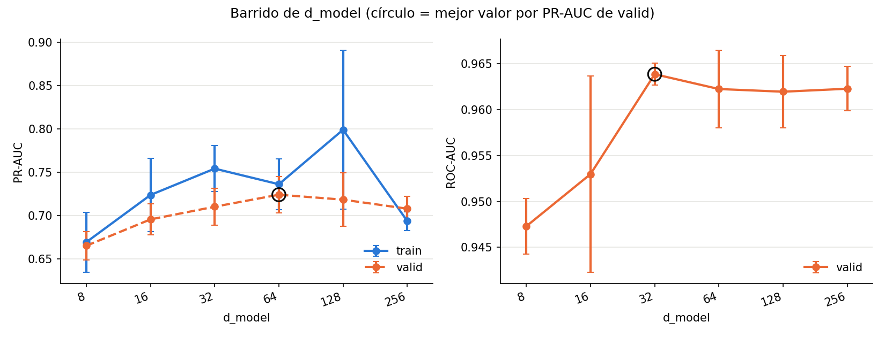

**Con el barrido completo, `d_model=64` queda confirmado como el techo real de este dial -- no era un límite artificial de la consigna.** La primera tanda (8 a 64) mostraba PR-AUC subiendo de forma monótona sin meseta, lo que hacía pensar que el techo estaba más allá de 64. Con 128 y 256, aparece un **pico interior**: PR-AUC baja en ambos (0,718 y 0,708, contra 0,724 en 64) -- más capacidad no solo no ayuda, empeora. En `d_model=128` además el gap de overfitting se dispara (0,081, el más alto de todo el barrido, con mucha variabilidad entre semillas, std 0,063) -- coherente con más parámetros (219.137, ya 31x las 7.012 filas de train) sin más señal real que aprovechar. En `d_model=256` el gap da negativo (-0,014, valid ligeramente por encima de train en la mejor época) -- con 700.289 parámetros (100x las filas de train) el modelo ya no logra ajustar bien ni siquiera train en 20 épocas, un indicio de que necesitaría muchas más épocas para converger a ese tamaño, no de que generalice mejor. ROC-AUC se mantiene prácticamente plano en 0,962 en los 3 valores más altos (64/128/256), sin la caída ni la señal clara que sí muestra PR-AUC.

## Experimento 5 — barrido de `dim_feedforward`: 16 / 32 / 64 (Exp. 3) / 128 / 256 / 512

`d_model=16` fijo (la base, no la ganadora de d_model del Experimento 4 -- ver nota metodológica abajo). Primera tanda: 16, 32, 128. **Segunda tanda (256, 512)**: mismo criterio que la extensión del Experimento 4 -- la tanda original ya mostraba un pico interior en 64 con un solo punto de caída confirmándolo (128), así que se agregaron más puntos por encima para confirmar la tendencia con más de una observación, no quedarse con la caída de un solo punto.

Media ± std sobre 3 semillas (`output/experiment5_results.csv`):

| `dim_feedforward` | n_params | valid PR-AUC | valid ROC-AUC | gap PR-AUC |
|---|---|---|---|---|
| 16 | 10.001 | 0,680 ± 0,051 | **0,954 ± 0,007** | 0,064 ± 0,044 |
| 32 | 11.057 | 0,674 ± 0,035 | 0,954 ± 0,007 | 0,063 ± 0,027 |
| **64 (Exp. 3)** | 13.169 | **0,696 ± 0,018** | 0,953 ± 0,011 | 0,028 ± 0,042 |
| 128 | 17.393 | 0,688 ± 0,017 | 0,953 ± 0,006 | 0,049 ± 0,058 |
| 256 | 25.841 | 0,680 ± 0,005 | 0,951 ± 0,011 | 0,055 ± 0,023 |
| 512 | 42.737 | 0,675 ± 0,030 | 0,953 ± 0,008 | 0,060 ± 0,045 |

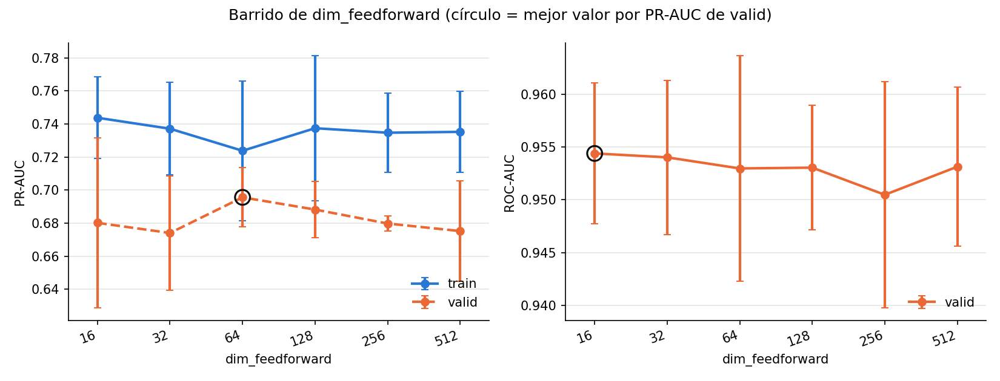

**Con el barrido completo, el pico interior en `dim_feedforward=64` queda confirmado, no es un efecto de un solo punto.** `dim_feedforward=64` (la proporción 4x sobre `d_model=16` del paper original) sigue siendo el mejor, y **todos** los valores por encima (128, 256, 512) quedan peor, estabilizándose alrededor de 0,675-0,688 sin volver a mejorar ni empeorar mucho más -- a diferencia del `d_model=256` del Experimento 4, acá no aparecen gaps raros ni señales de no-convergencia, los valores de overfitting se mantienen en un rango razonable (0,049-0,064) en todo el rango extendido. ROC-AUC prácticamente no se mueve en todo el rango (0,951-0,954, dentro del ruido). Esto confirma la intuición de la sección anterior de `Notas.md`: `dim_feedforward` no es "cuanto más mejor" de forma libre, tiene un punto óptimo relacionado con `d_model` -- consistente con la idea de que un feed-forward angosto es un cuello de botella y uno demasiado ancho agrega parámetros sin beneficio claro.

### Análisis conjunto -- ¿hace falta un Experimento 6 combinando ambos?

Este era justamente el punto que se planteó antes de correr el 4 y el 5: si los dos muestran que sus valores óptimos dependen uno del otro, hay que combinarlos.

La evidencia apunta a que sí, por lo siguiente: en el Experimento 5 (con `d_model=16` fijo) el óptimo de `dim_feedforward` fue 64 -- exactamente la proporción 4x. Pero el Experimento 4 mantuvo `dim_feedforward=64` fijo mientras subía `d_model`, así que en el punto ganador (`d_model=64`) la proporción real terminó siendo **1x**, no 4x -- y aun así fue el mejor resultado de todo lo corrido hasta ahora (PR-AUC 0,724). Dos lecturas posibles, y no podemos distinguirlas con lo que corrimos:

1. La proporción 4x importa, y `d_model=64` con `dim_feedforward=256` (manteniendo el 4x) daría un resultado todavía mejor que 0,724.
2. La proporción no es tan determinante como sugería el Experimento 5 a `d_model=16` -- lo que importa es la capacidad absoluta de `d_model`, y `dim_feedforward=64` ya alcanza como "suficiente" ancho de MLP en el rango que probamos.

No hay forma de saber cuál es cierta sin probar directamente `d_model=64` con `dim_feedforward` escalado. **Conclusión: sí hace falta el Experimento 6.**

### Qué cambió respecto a los Experimentos 4 y 5

Se probó puntualmente si escalar `dim_feedforward` junto con `d_model` (manteniendo la proporción 4x) mejora los mejores puntos del Experimento 4, en vez de un grid completo (4x4 combinaciones x 3 semillas = 48 corridas habría sido demasiado para lo que responde esta pregunta puntual).

## Experimento 6 — ¿escalar `dim_feedforward` junto con `d_model`?

Dos combinaciones nuevas, manteniendo `n_heads=1`, `n_layers=2`: `d_model=32` con `dim_feedforward=128` (4x), y `d_model=64` con `dim_feedforward=256` (4x). Comparadas contra las mismas filas de `d_model=32` y `64` del Experimento 4 (`dim_feedforward=64` fijo ahí, o sea 2x y 1x respectivamente).

Media ± std sobre 3 semillas (`output/experiment6_results.csv`):

| `d_model` | `dim_feedforward` | proporción | n_params | valid PR-AUC | valid ROC-AUC | gap PR-AUC |
|---|---|---|---|---|---|---|
| 32 | 64 (Exp. 4) | 2x | 30.305 | 0,710 ± 0,022 | 0,964 ± 0,001 | 0,044 ± 0,047 |
| 32 | 128 | 4x | 38.625 | 0,713 ± 0,025 | 0,962 ± 0,004 | 0,049 ± 0,004 |
| 64 | 64 (Exp. 4) | 1x | 76.865 | **0,724 ± 0,021** | 0,962 ± 0,004 | **0,012 ± 0,014** |
| 64 | 256 | 4x | 126.401 | 0,721 ± 0,025 | 0,963 ± 0,003 | 0,099 ± 0,070 |

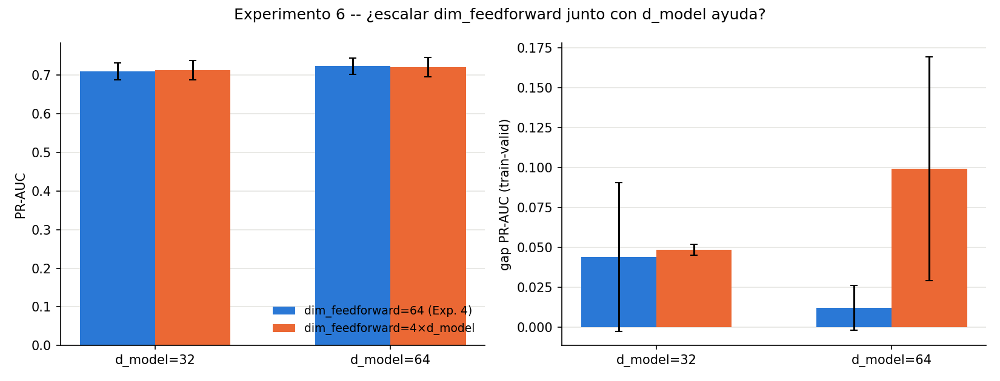

### Análisis

- **PR-AUC casi no cambia al escalar `dim_feedforward`** en ninguno de los dos `d_model` (32: 0,710→0,713; 64: 0,724→0,721) — las diferencias están completamente dentro del desvío estándar de cada punto (~0,02). El panel izquierdo del gráfico lo muestra claro: las barras son prácticamente idénticas en altura.
- **Donde sí hay un efecto real y grande es en el overfitting**, y va en la dirección contraria a lo esperado: en `d_model=64`, pasar de `dim_feedforward=64` a `256` casi **octuplica** el gap de generalización (0,012 → 0,099), con además mucha más varianza entre semillas (std 0,070). Son 126.401 parámetros contra 76.865 filas efectivas de entrenamiento un orden de magnitud menor — el feed-forward más ancho agrega capacidad que el modelo termina memorizando en vez de generalizar, sin que la performance de valid lo compense.
- **Conclusión: gana la hipótesis 2.** La proporción 4x que fue determinante en el Experimento 5 (a `d_model=16` fijo) **no se sostiene** al escalar `d_model` — ahí lo que pesa es la capacidad absoluta de `d_model`, y `dim_feedforward=64` ya alcanza como ancho de MLP en todo el rango probado (16 a 64). Escalarlo junto con `d_model` no ayuda y en el punto más grande directamente perjudica la generalización.
- **Este dial queda cerrado**: `d_model=64`, `dim_feedforward=64` es la configuración ganadora (PR-AUC valid 0,724 ± 0,021, el mejor resultado de todos los experimentos corridos hasta ahora). La arquitectura base para seguir es `n_heads=1`, `n_layers=2`, `d_model=64`, `dim_feedforward=64`.

### Qué cambió respecto al Experimento 6

Con `n_heads`, `n_layers`, `d_model` y `dim_feedforward` ya cerrados sobre el Transformer de texto puro, se pasó al sistema completo: texto + features tabulares combinadas (`CombinedModel` en `model.py`), usando la rama de texto ganadora tal cual (`n_heads=1`, `n_layers=2`, `d_model=64`, `dim_feedforward=64`). Los dials de `positional encoding` y `pooling` quedan pendientes -- se decidió priorizar tener el sistema completo funcionando antes de seguir afinando detalles del Transformer solo (ver discusión previa a este experimento).

## Experimento 7 — sistema completo: texto + tabular

### Arquitectura ([`model.py`](experiments/model.py))

`CombinedModel`: el `TextEncoder` (idéntico al usado en los Experimentos 1-6, ahora extraído como pieza compartida) resume `title`+`description` en un vector de 64 dimensiones; ese vector se concatena con el vector de features tabulares ya encodeadas (75 columnas: numéricas z-scoreadas, one-hot de categóricas, multi-hot de ingredientes -- ver `Notas.md`/`encode_features.py`) y el vector combinado (139 dimensiones) entra directo a una salida `Linear(139 → 1)`, sin capa oculta intermedia -- mismo criterio minimalista del Experimento 1 ("el vector va directo a la predicción, la versión más mínima posible"), aplicado ahora al vector combinado en vez de solo al de texto. El texto nunca ve lo tabular (no pasa por el Transformer) y lo tabular nunca pasa por atención -- se juntan recién en esa última capa.

### Configuración de entrenamiento

Misma que los experimentos anteriores: Adam (`lr=1e-3`), `batch_size=128`, 20 épocas, 3 semillas (0, 1, 2).

### Resultados

Mejor época de cada semilla (`output/experiment7_results.csv`):

| seed | best_epoch | valid PR-AUC | valid ROC-AUC | train PR-AUC | gap PR-AUC |
|---|---|---|---|---|---|
| 0 | 13 | 0,710 | 0,966 | 0,782 | 0,072 |
| 1 | 10 | 0,699 | 0,966 | 0,737 | 0,038 |
| 2 | 10 | 0,744 | 0,969 | 0,771 | 0,027 |
| **media ± std** | — | **0,718 ± 0,023** | **0,967 ± 0,002** | — | **0,045 ± 0,024** |

Comparación directa contra la rama de texto sola con la misma arquitectura interna (`d_model=64` del Experimento 4/6, sin tabular):

| | Solo texto (Exp. 4/6) | Texto + tabular (Exp. 7) |
|---|---|---|
| n_params | 76.865 | 76.940 |
| valid PR-AUC (media ± std) | **0,724 ± 0,021** | 0,718 ± 0,023 |
| valid ROC-AUC (media ± std) | 0,962 ± 0,004 | **0,967 ± 0,002** |
| gap PR-AUC (media ± std) | **0,012 ± 0,014** | 0,045 ± 0,024 |
| mejor época (típica) | ~15-20 | ~10-13 |

Curvas de entrenamiento, `output/experiment7_curves.png`:

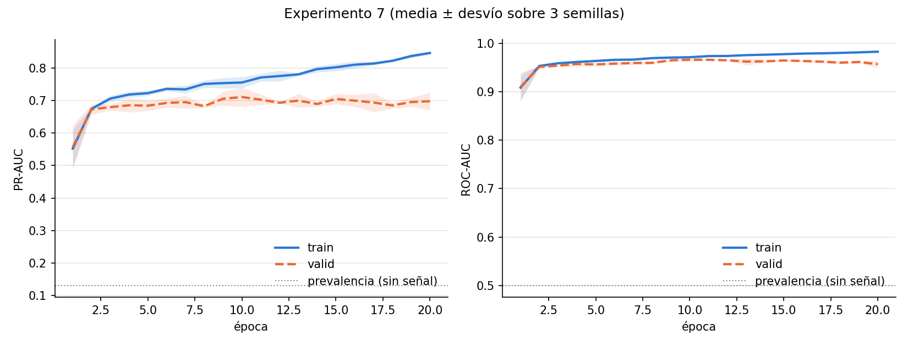

### Análisis

- **Resultado contraintuitivo: agregar lo tabular no mejoró PR-AUC.** 0,718 contra 0,724 del texto solo -- la diferencia está totalmente dentro del solapamiento de los desvíos estándar, así que no hay evidencia de que empeore, pero tampoco de que ayude. Con solo 75 features tabulares más y una sola capa lineal para combinarlas con el texto, el modelo no encontró en ellas señal adicional que el texto no tuviera ya -- consistente con el hallazgo de `ejercicio1` de que el tag de reputación embebido en `title` ya captura buena parte de la señal, y con que varias tabulares (`country_of_origin`, `nutrition_score`) habían quedado marcadas como "dudosas" en el EDA por señal univariada débil.
- **ROC-AUC sí mejoró** (0,962 → 0,967) -- las tabulares ayudan a ordenar mejor los casos en general, aunque no a nivel de precisión sobre los candidatos más probables (que es lo que mide PR-AUC).
- **El overfitting empeoró bastante, y aparece mucho antes.** El gap casi se cuadruplica (0,012 → 0,045) y la mejor época baja de ~15-20 a ~10-13 -- se ve clarísimo en el gráfico: valid PR-AUC se estanca alrededor de la época 3-5 mientras train sigue subiendo derecho hasta 0,85. Con 139 dimensiones de entrada a una sola capa lineal (contra 64 del texto solo) y el mismo dataset chico, el modelo tiene más con qué memorizar sin que haya más señal real proporcional para justificarlo.
- **Hipótesis para explicar por qué no ayudó**: la capa de salida es un solo `Linear` -- puede aprender a pesar cada feature tabular por separado, pero no puede aprender una interacción entre "lo que dice el texto" y "lo que dicen las tabulares" (por ejemplo, que el tag de reputación importe más o menos según la categoría del producto). Eso requeriría una capa oculta no-lineal después de la concatenación, que se descartó en el diseño por el mismo criterio minimalista que venimos aplicando desde el Experimento 1 -- ahora es candidato a revisar.

### Qué cambió respecto al Experimento 7

Se agregó una capa oculta de 64 unidades a la cabeza de salida del sistema completo (`hidden=64` en `CombinedModel`), manteniendo el resto igual, para probar si el estancamiento del Experimento 7 se debía a la falta de una no-linealidad que cruce texto y tabular.

## Experimento 8 — capa oculta en la cabeza de salida

### Arquitectura ([`model.py`](experiments/model.py))

Igual que el Experimento 7 salvo la cabeza: `Linear(139 → 64) → ReLU → Dropout(0,1) → Linear(64 → 1)` en vez de `Linear(139 → 1)` directo. `hidden=64` iguala el ancho de la rama de texto (`d_model=64`) -- ni más angosto (perdería capacidad) ni mucho más ancho (más riesgo de overfitting sin motivo), consistente con "arrancar chico".

### Resultados

Corrida inicial con `EPOCHS=20`: valid PR-AUC seguía subiendo en las 3 semillas sin señales de meseta (0,791 ± 0,006 en la mejor época, que caía siempre en 19 o 20) -- así que se repitió la misma config con `EPOCHS=40` para confirmar si convenía entrenar más tiempo antes de cerrar el resultado. Los números de acá son de esa corrida de 40 épocas (`output/experiment8_results.csv`):

| seed | best_epoch | valid PR-AUC | valid ROC-AUC | train PR-AUC | gap PR-AUC |
|---|---|---|---|---|---|
| 0 | 34 | 0,807 | 0,965 | 0,939 | 0,132 |
| 1 | 24 | 0,794 | 0,968 | 0,941 | 0,147 |
| 2 | 21 | 0,792 | 0,971 | 0,897 | 0,105 |
| **media ± std** | — | **0,798 ± 0,008** | 0,968 ± 0,003 | — | 0,128 ± 0,021 |

Comparación contra el Experimento 7 (misma arquitectura, sin capa oculta) y contra el mejor resultado de solo texto (Exp. 4/6):

| | Solo texto (Exp. 4/6) | Texto + tabular, sin capa oculta (Exp. 7) | Texto + tabular, con capa oculta (Exp. 8, 40 épocas) |
|---|---|---|---|
| n_params | 76.865 | 76.940 | 85.825 |
| valid PR-AUC (media ± std) | 0,724 ± 0,021 | 0,718 ± 0,023 | **0,798 ± 0,008** |
| valid ROC-AUC (media ± std) | 0,962 ± 0,004 | 0,967 ± 0,002 | **0,968 ± 0,003** |
| gap PR-AUC (media ± std) | 0,012 ± 0,014 | 0,045 ± 0,024 | 0,128 ± 0,021 |

Curvas de entrenamiento (ahora hasta la época 40), `output/experiment8_curves.png`:

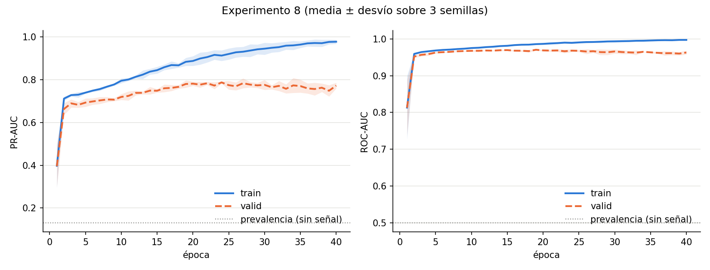

Comparación directa de 20 vs. 40 épocas (`output/experiment8_epochs.png`, generado por `plot_experiment8_epochs.py` -- recorta las mismas corridas de 40 épocas hasta la época 20, sin reentrenar, ya que el entrenamiento es determinístico dada la semilla):

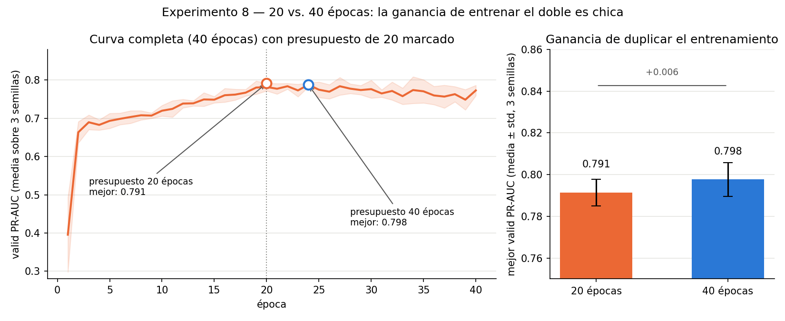

Mejor PR-AUC de valid alcanzable con presupuesto de 20 épocas: 0,791 ± 0,006. Con 40 épocas: 0,798 ± 0,008. Diferencia: 0,006 -- la curva ya está prácticamente aplanada en la época 20.

### Análisis

- **Confirma la hipótesis del Experimento 7 de forma contundente.** Agregar la no-linealidad a la cabeza sigue siendo la mejor marca de todos los experimentos corridos hasta ahora (0,798, contra 0,724 del texto solo y 0,718 sin capa oculta) -- el problema del Experimento 7 no era que las tabulares no aportaran señal, era que la cabeza lineal no podía aprovecharla.
- **Con 40 épocas ya se ve el techo que con 20 no se veía**: en el gráfico, valid PR-AUC sube fuerte hasta ~época 20-25 (llega a ~0,78-0,79) y ahí se aplana -- de hecho baja un poco hacia la época 40 (~0,76-0,77 en la media), mientras train sigue subiendo derecho hasta ~0,97. La ganancia de 0,791 (20 épocas) a 0,798 (40 épocas, tomando la mejor época de cada semilla) es chica y viene de picos puntuales de alguna semilla (época 34 en la seed 0) más que de una mejora sostenida de las tres -- **20 épocas ya daban un resultado representativo**, entrenar más no cambia la conclusión, solo agrega ruido y más overfitting (el gap casi se triplica, 0,045 → 0,128).
- **Conclusión**: la arquitectura queda cerrada en `n_heads=1, n_layers=2, d_model=64, dim_feedforward=64, hidden=64`, con **~20-25 épocas** como rango razonable de entrenamiento (no hace falta ir a 40). Este es el mejor sistema completo encontrado hasta ahora, PR-AUC valid ≈ 0,79.

### Qué cambió respecto al Experimento 8

Con la arquitectura ya cerrada (`n_heads=1, n_layers=2, d_model=64, dim_feedforward=64, hidden=64`, 20 épocas), se pasó a ablacionar dos features tabulares puntuales que quedaron marcadas como "dudosas" desde el EDA de `ejercicio1` por señal univariada débil: `country_of_origin` y `nutrition_score`.

## Experimento 9 — ablation de `country_of_origin` y `nutrition_score`

### Variantes

4 configuraciones, misma arquitectura y semillas que el Experimento 8, sacando columnas por prefijo (`exclude_prefixes` en `train.py`, ver `run_experiment9.py`):
- `full`: todas las features (= Experimento 8, reentrenado acá para que las 4 variantes salgan de la misma corrida).
- `sin_country_of_origin`: sin las 10 columnas one-hot de `country_of_origin`.
- `sin_nutrition_score`: sin `nutrition_score_z`.
- `sin_ambas`: sin las dos.

### Resultados

Media ± std sobre 3 semillas (`output/experiment9_results.csv`):

| variante | n_params | valid PR-AUC | valid ROC-AUC | gap PR-AUC |
|---|---|---|---|---|
| **full** | 85.825 | **0,791 ± 0,006** | 0,970 ± 0,002 | 0,094 ± 0,030 |
| sin_country_of_origin | 85.185 | 0,786 ± 0,012 | **0,971 ± 0,001** | 0,090 ± 0,023 |
| sin_ambas | 85.121 | 0,785 ± 0,012 | 0,969 ± 0,002 | **0,076 ± 0,014** |
| sin_nutrition_score | 85.761 | 0,760 ± 0,019 | 0,968 ± 0,004 | 0,118 ± 0,032 |

Por semilla (para ver si el efecto es consistente o un promedio engañoso):

| variante | seed 0 | seed 1 | seed 2 |
|---|---|---|---|
| full | 0,799 | 0,788 | 0,787 |
| sin_country_of_origin | 0,793 | 0,772 | 0,793 |
| sin_nutrition_score | 0,741 | 0,760 | 0,778 |
| sin_ambas | 0,796 | 0,772 | 0,786 |

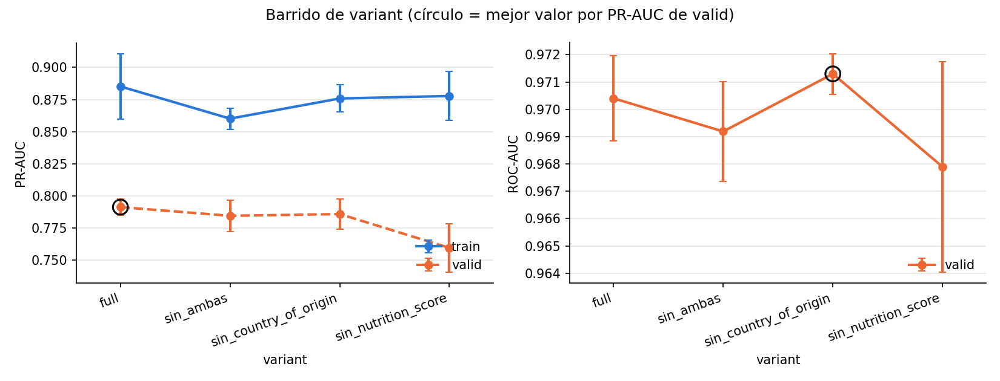

### Análisis

- **`nutrition_score` sí aporta señal real -- `country_of_origin` no tanto.** Sacar `nutrition_score` baja PR-AUC en las 3 semillas de forma consistente (0,799→0,741, 0,788→0,760, 0,787→0,778), una caída de 0,031 en promedio que es grande comparada con el desvío de cada punto (~0,006-0,019) -- no parece ruido. Sacar `country_of_origin` en cambio da un resultado mixto por semilla (0,793 vs 0,799 en seed 0, casi igual; 0,772 vs 0,788 en seed 1, baja; 0,793 vs 0,787 en seed 2, sube) y la caída promedio (0,005) es chica frente al desvío -- no hay evidencia clara de que aporte.
- **Resultado raro que hay que dejar anotado, no esconder**: `sin_ambas` (0,785) queda mejor que `sin_nutrition_score` sola (0,760), cuando lo esperable sería que sacar las dos fuera igual o peor que sacar solo la que más pesa. Mirando semilla por semilla, `sin_ambas` se parece más a `sin_country_of_origin` que a `sin_nutrition_score` en las 3 semillas -- posible interacción entre ambas features (o simplemente ruido de tener solo 3 semillas por variante, que es la explicación más simple). No hay forma de distinguir estas dos lecturas con lo corrido -- si esto importara para la decisión final, habría que correr más semillas para esta comparación puntual, pero no cambia la conclusión principal de abajo.
- **`country_of_origin` es candidata a sacar del modelo final**: no hay evidencia de que sume, y sacarla achica el modelo (85.825 → 85.185 parámetros) sin costo aparente en PR-AUC. `nutrition_score` en cambio se queda -- hay evidencia consistente de que aporta.

### Qué cambiar en el próximo experimento (propuesta a confirmar)

Con esto, los frentes que quedan abiertos son: (1) los dials pendientes del Transformer de texto (positional encoding, pooling) y (2) evaluar en test una sola vez con la configuración final, como cierre del estudio de ablación. Dado el resultado de este experimento, la config final candidata para ir a test sería `full` sin `country_of_origin` (manteniendo `nutrition_score`) -- a confirmar si la corremos como paso previo a test o si se va directo a test con `full` y se deja esta simplificación como una observación más en la presentación.

### Qué cambió respecto al Experimento 9

Antes de dar por cerrada la arquitectura, se volvió sobre un cabo suelto: la cabeza de salida (`hidden=64` en el Experimento 8) se había fijado probando un solo valor, no con un barrido como los demás dials de capacidad (`d_model`, `dim_feedforward`, `n_layers`) -- inconsistente con el resto del estudio. Se chequeó además si el material de cátedra prescribe alguna arquitectura de cabeza de clasificación sobre un Encoder-only y no aparece (`transformers.VTT` solo menciona de pasada que un Transformer "puede ser clasificación también"; en `consigna.VTT` un compañero preguntó exactamente esto y la respuesta fue "tienen que pensar dónde iría" -- se lo devolvieron al grupo a propósito). O sea que ni `Linear` directo ni `Linear+ReLU+Linear` son "la versión de la cátedra"; corresponde tratarlo como un dial más y barrerlo.

## Experimento 10 — barrido de `hidden` (ancho de la capa oculta de la cabeza)

### Arquitectura

Igual que el Experimento 9 (`full`, con `country_of_origin` y `nutrition_score`), variando solo `hidden`. `hidden=0` representa "sin capa oculta" (`Linear` directo, Experimento 7); los demás valores agregan `Linear(139→hidden) → ReLU → Dropout → Linear(hidden→1)`.

### Resultados

Media ± std sobre 3 semillas (`output/experiment10_results.csv`; `hidden=0` reusa el Experimento 7, `hidden=64` reusa la fila `full` del Experimento 9 -- ambos a 20 épocas, misma arquitectura de base, sin reentrenar):

| `hidden` | n_params | valid PR-AUC | valid ROC-AUC | gap PR-AUC |
|---|---|---|---|---|
| 0 (Exp. 7) | 76.940 | 0,718 ± 0,023 | 0,967 ± 0,002 | 0,045 ± 0,024 |
| 32 | 81.313 | 0,729 ± 0,005 | 0,968 ± 0,000 | 0,084 ± 0,010 |
| 64 (Exp. 9 `full`) | 85.825 | 0,791 ± 0,006 | 0,970 ± 0,002 | 0,094 ± 0,030 |
| 128 | 94.849 | 0,798 ± 0,007 | 0,971 ± 0,002 | 0,110 ± 0,007 |
| 256 | 112.897 | 0,816 ± 0,013 | 0,973 ± 0,002 | 0,111 ± 0,020 |
| **512** | 148.993 | **0,820 ± 0,007** | **0,975 ± 0,001** | 0,104 ± 0,003 |

El barrido se extendió a 512 en una segunda tanda dentro de este mismo experimento, porque en 256 todavía no se veía meseta -- ver análisis.

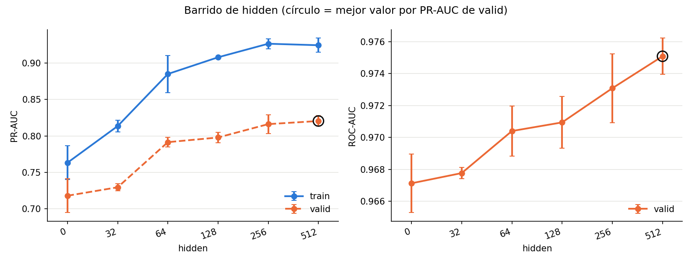

### Análisis

- **Con 512 recién aparece la meseta que en 256 no se veía.** El incremento 128→256 había sido +0,018; el de 256→512 es +0,004 -- un orden de magnitud más chico, y dentro del solapamiento de los desvíos estándar de ambos puntos. En el gráfico se ve clarísimo: tanto train como valid se aplanan entre 256 y 512, después de subir sostenido en todo el resto del barrido.
- **`hidden=512` es la mejor marca de todo el estudio** (PR-AUC valid 0,820 ± 0,007), pero por un margen chico sobre `hidden=256` (0,816) a cambio de 36.096 parámetros más (112.897 → 148.993, ya 21x las 7.012 filas de train). El gap de overfitting incluso baja un poco (0,111 → 0,104) y con la varianza más baja de todo el barrido (std 0,003) -- un resultado más estable, no más overfitteado, pero la ganancia de PR-AUC ya no justifica claramente seguir agrandando.
- **Conclusión: este dial queda cerrado en la meseta, no en el extremo probado.** A diferencia de `d_model` (que se cerró en el límite superior probado sin encontrar techo), acá sí se encontró un techo real: seguir subiendo `hidden` más allá de 512 previsiblemente sigue dando mejoras cada vez más chicas, sin justificar el costo. `hidden=256` o `512` son ambas defendibles como elección final (diferencia de 0,004 en PR-AUC); se prioriza **`hidden=256`** por el mismo criterio de "arrancar chico" que guio el resto del estudio, dejando `512` documentado como el punto de referencia que confirma la meseta.

### Qué cambiar en el próximo experimento (propuesta a confirmar)

Con la arquitectura del sistema completo ya cerrada de punta a punta (`n_heads=1, n_layers=2, d_model=64, dim_feedforward=64, hidden=256`, ~20 épocas, PR-AUC valid ≈ 0,82), quedan dos frentes: los dials pendientes del Transformer de texto solo (positional encoding, pooling), o evaluar en test una sola vez con esta configuración final, como cierre del estudio de ablación.

**Sobre esos dos dials pendientes**: se decidió priorizar `positional encoding`, que sí está desarrollado en clase (`transformers.VTT`: "lo hacés para darle un orden a tus tokens", más la motivación de por qué un índice simple no generaliza y la fórmula senoidal), y dejar `pooling` como default bien justificado sin experimento propio -- no tiene una versión "de cátedra" con la que compararlo (ver discusión completa más abajo), y estructuralmente no se puede sacar del todo (alguna forma de reducir la secuencia a un vector es inevitable para clasificar).

## Experimento 11 — con/sin positional encoding

### Alcance

Se corre sobre el **Transformer de texto solo** (arquitectura ganadora de los Experimentos 4/6: `n_heads=1, n_layers=2, d_model=64, dim_feedforward=64`), no sobre el sistema completo -- para aislar el efecto sin que las features tabulares puedan compensar la pérdida de información de orden.

### Arquitectura ([`model.py`](experiments/model.py))

`TextEncoder` ahora acepta `use_positional_encoding: bool`. Sin él, se salta la suma del vector senoidal y el embedding entra directo al encoder -- sin parámetros nuevos (el positional encoding es un buffer fijo, no aprendido), así que el conteo de parámetros no cambia entre variantes.

### Resultados

Media ± std sobre 3 semillas (`output/experiment11_results.csv`; `con_positional_encoding` reusa la fila `d_model=64` del Experimento 4, sin reentrenar):

| variante | n_params | valid PR-AUC | valid ROC-AUC | train PR-AUC | gap PR-AUC |
|---|---|---|---|---|---|
| con_positional_encoding | 76.865 | 0,724 ± 0,021 | 0,962 ± 0,004 | 0,736 | **0,012 ± 0,014** |
| sin_positional_encoding | 76.865 | 0,720 ± 0,001 | 0,962 ± 0,001 | 0,893 | 0,174 ± 0,022 |

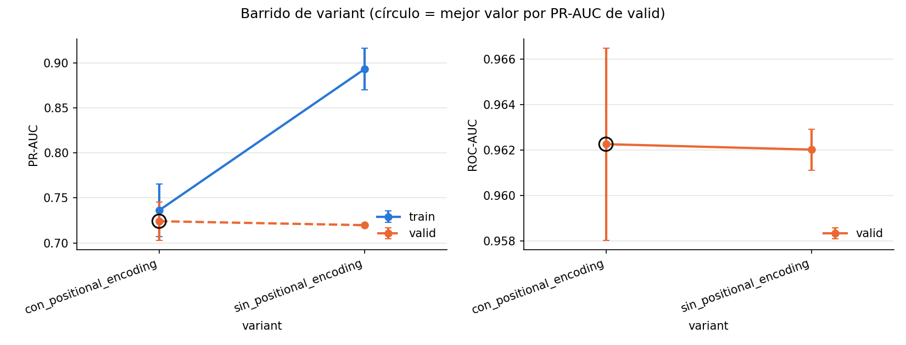

### Análisis

- **PR-AUC de valid casi no cambia** (0,724 → 0,720, diferencia mínima) -- sacar el positional encoding no le hace perder al modelo casi nada de capacidad de *alcanzar* un buen resultado en valid. Esto en principio sorprende dado el hallazgo de `ejercicio1` sobre el tag de reputación como patrón "posicional" en `title` -- pero puede explicarse porque ese patrón quizás sea más una cuestión de *qué* palabras aparecen juntas (que la atención puede captar igual sin orden, como "bag of words" con contexto) que de *en qué posición exacta* aparecen.
- **Donde sí hay un efecto enorme es en el overfitting.** El gap se dispara de 0,012 a **0,174** -- train PR-AUC llega a 0,89-0,92 sin positional encoding (contra 0,70-0,76 con él) mientras valid se queda clavado en ~0,72 con una consistencia llamativa entre semillas (std 0,0007, la más baja de todo el estudio). Se ve clarísimo en el gráfico: la curva de train se dispara mientras la de valid queda prácticamente plana.
- **Hipótesis (no confirmada, para dejar anotada)**: sin información de orden, la atención solo puede agrupar tokens por similitud de contenido -- sin la "grilla" que da el positional encoding, tiene menos restricción estructural para ajustarse a combinaciones específicas de palabras por fila de train en vez de aprender un patrón que generalice. O sea, el positional encoding no está ahí por la performance pico en sí, sino que actúa como una forma de regularización implícita.
- **Conclusión**: el positional encoding se queda en la arquitectura -- no tanto por el PR-AUC pico (que casi no cambia), sino porque sin él el modelo overfittea muchísimo más rápido y más fuerte, lo cual sería un problema real en un dataset todavía más chico o entrenando más épocas.

### Qué cambiar en el próximo experimento (propuesta a confirmar)

Con esto, los dos frentes pendientes del Transformer de texto quedan resueltos (positional encoding confirmado con datos, pooling documentado como default razonado sin necesidad de experimento). El paso que queda es **evaluar en test una sola vez** con la configuración final completa (`n_heads=1, n_layers=2, d_model=64, dim_feedforward=64, hidden=256`, con `nutrition_score` y sin `country_of_origin` según el Experimento 9), como cierre del estudio de ablación -- test no se toca hasta este punto, según lo acordado en `Notas.md`.

## Evaluación final en test

### Configuración

La ganadora de todo el estudio de ablación (Experimentos 1 a 11), evaluada **una sola vez** en `data/test.csv` -- hasta acá test no se había tocado, solo train/valid ([`evaluate_test.py`](experiments/evaluate_test.py)):
- `CombinedModel`: `n_heads=1, n_layers=2, d_model=64, dim_feedforward=64, hidden=256`, positional encoding senoidal.
- Features tabulares: todas menos `country_of_origin` (Experimento 9); `nutrition_score` incluida.
- 20 épocas, seleccionando por semilla el checkpoint de la época con mejor PR-AUC de valid (mismo criterio de "mejor época" del resto del estudio, guardando acá los pesos de esa época concreta para poder evaluarlos en test).
- 3 semillas (0, 1, 2), promediadas.

### Resultados

`output/test_results.csv`:

| seed | mejor época (por valid) | test PR-AUC | test ROC-AUC |
|---|---|---|---|
| 0 | 16 | 0,806 | 0,962 |
| 1 | 13 | 0,813 | 0,966 |
| 2 | 15 | 0,809 | 0,967 |
| **media ± std** | — | **0,809 ± 0,003** | **0,965 ± 0,003** |

Curvas de entrenamiento con el resultado de test superpuesto (`output/final_curves.png`):

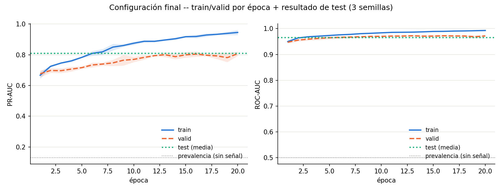

### Análisis

- **Test confirma lo que decía valid, sin sorpresas.** 0,809 de PR-AUC en test es prácticamente el mismo número que veníamos viendo en valid en las épocas 13-16 (0,80-0,82 en el Experimento 10) -- y con la varianza más baja de todo el estudio (std 0,003 entre semillas). Esto es la mejor señal posible de que las decisiones de arquitectura tomadas en base a valid a lo largo de 11 experimentos no terminaron sobreajustadas a ese split en particular.
- **Resultado final: PR-AUC de test 0,809 (vs. 0,130 de prevalencia) y ROC-AUC 0,965 (vs. 0,5 de azar)** -- una mejora sustancial sobre no tener modelo, y sobre el punto de partida del Experimento 1 (Transformer de texto solo, mínimo: 0,688 de PR-AUC en valid). El camino completo del estudio de ablación (heads → layers → d_model → dim_feedforward → fusión con tabular → capa oculta de la cabeza → ancho de esa capa → features dudosas → positional encoding) explica de punta a punta cómo se llegó de un punto a otro, con cada paso justificado y medido.

Con esto se cierra el Ejercicio 2. Queda pendiente el Ejercicio 3 (personalización, teórico) y armar la presentación final con este recorrido.
