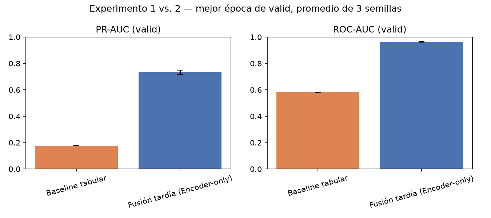
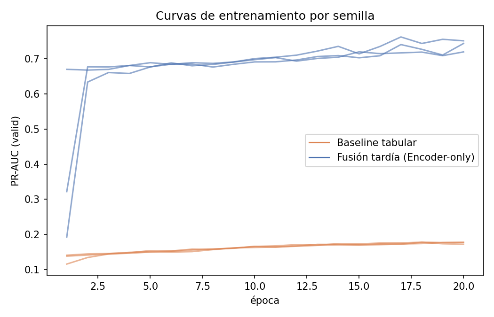
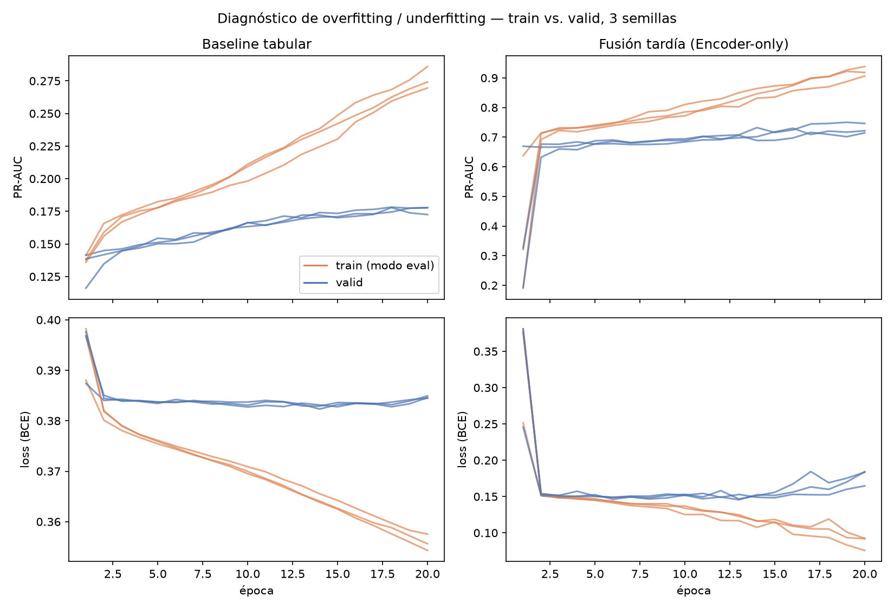
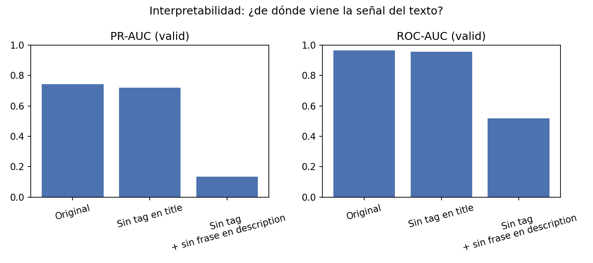
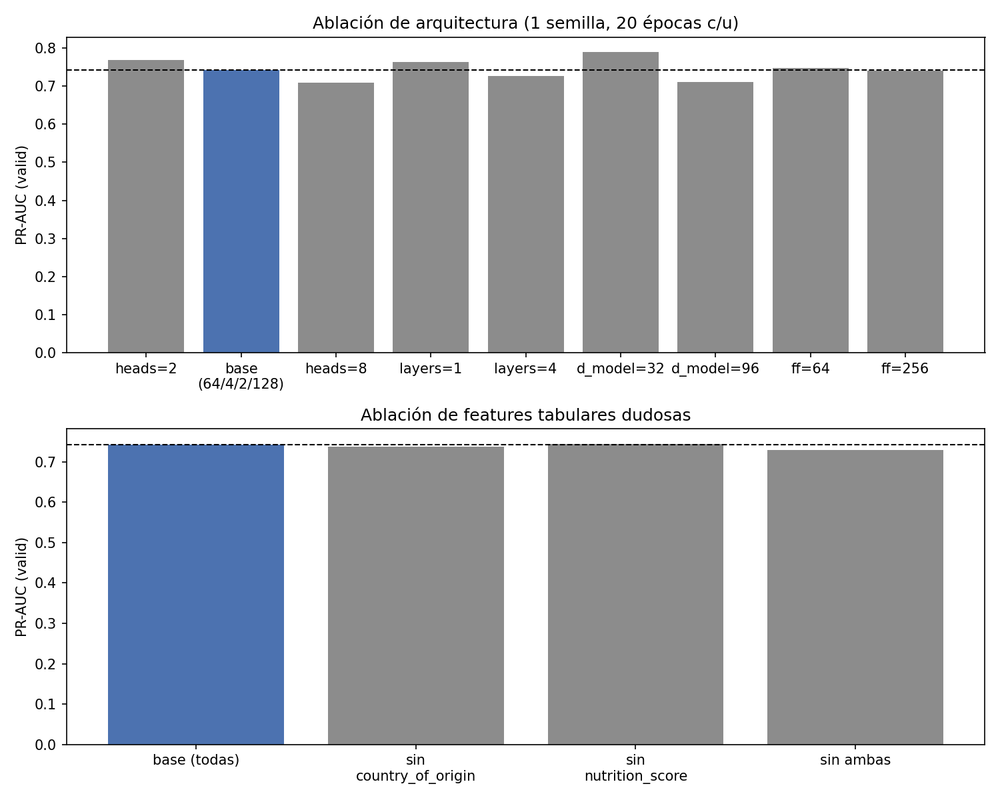

# Experimentos — Ejercicio 2

Registro de cada experimento corrido: configuración, resultados y análisis, para no tener que reconstruir esto de memoria al armar la presentación. Complementa a `Notas.md` (que tiene las decisiones de diseño); acá van los **números**.

Convención: scripts de cómputo (`train.py`, `run_experiments.py`) separados de los de gráficos (`plot_experiments.py`), igual que en el resto del TP — los gráficos de esta nota se generan leyendo `output/experiment_results.csv` y `output/runs/*.csv`, nunca reentrenando.

## Setup común

- **Datos**: `data/train.csv` / `data/valid.csv` (split de `split_data.py` + encoding de `encode_features.py`). Todas las métricas de esta nota son sobre **valid** — test no se toca hasta tener una configuración final elegida (ver `Notas.md`, sección "Split train/valid/test").
- **Arquitectura del bloque de texto**: Encoder-only (confirmado con el grupo, ver `Notas.md`) — `d_model=64`, 4 heads, 2 encoders apilados, MLP interno de 128, dropout 0.1. Implementado con `nn.TransformerEncoderLayer`/`nn.TransformerEncoder` de PyTorch (los módulos estándar, no atención hecha a mano) + positional encoding senoidal (el de la clase, `transformers.VTT`) + mean-pooling sobre los tokens no-pad para resumir la secuencia en un vector (`model.py::TextEncoder`).
- **Fusión con lo tabular**: tardía — el vector de texto (64) se concatena con el vector tabular (75 columnas: numéricas z-scoreadas + one-hot + multi-hot) y pasa por una capa densa (64) + salida (1 logit) (`model.py::EncoderFusionModel`).
- **Entrenamiento**: Adam (`lr=1e-3`), `BCEWithLogitsLoss`, batch size 128, 20 épocas. **No se agregó ponderación de clases ni ninguna técnica específica para el desbalance** (13% positivos) — no vimos nada puntual en clase para esto (ver `ejercicio1/Notas.md`), así que se dejó la loss estándar y se confía en PR-AUC/ROC-AUC como métrica (más informativa que accuracy con desbalance).
- **Métricas**: PR-AUC y ROC-AUC sobre valid, sin threshold (la consigna aclara que no hace falta). Se reporta la **mejor época según PR-AUC de valid** (no la última — ver curvas más abajo, siguen mejorando lentamente incluso en la época 20). Las mismas 3 métricas (loss, PR-AUC, ROC-AUC) se miden además **sobre train en modo eval**, para poder diagnosticar overfitting/underfitting comparando ambas curvas — ver la sección correspondiente más abajo.
- **Semillas**: 3 corridas por configuración (semillas 0, 1, 2), se reporta media ± desvío — siguiendo la recomendación de `consigna.VTT` de promediar varias corridas en vez de una sola.
- **Reproducibilidad**: las semillas están fijadas (`torch.manual_seed`) y las corridas son deterministas *dentro de un mismo entorno*. Ojo: **los resultados del bloque Transformer dependen de la versión de PyTorch** — ver la sección "Nota de reproducibilidad" al final.

## Experimento 1: Baseline solo-tabular

Sin Transformer, sin texto — `model.py::TabularMLPBaseline`: capas densas (64 → 1) directo sobre las 75 columnas tabulares. Sirve como piso de comparación: si el modelo con texto no supera esto, sería evidencia de que `title`/`description` no está aportando.

| semilla | mejor época | PR-AUC (valid) | ROC-AUC (valid) |
|---|---|---|---|
| 0 | 18 | 0,178 | 0,579 |
| 1 | 20 | 0,178 | 0,583 |
| 2 | 18 | 0,178 | 0,579 |
| **media ± std** | | **0,178 ± 0,000** | **0,580 ± 0,002** |

Apenas por encima de la tasa base de `bought` (13,0%) en PR-AUC, y apenas por encima del azar (0,5) en ROC-AUC. Consistente con lo que ya habíamos visto en el EDA: las features tabulares con señal real (posición relativa del precio) son débiles comparadas con lo que se escondía en el texto, y `country_of_origin`/`nutrition_score` no aportaban nada en el cruce univariado.

## Experimento 2: Fusión tardía (Encoder-only + tabular)

`model.py::EncoderFusionModel` — el mismo tabular de arriba, pero concatenado con el vector que sale del Encoder-only sobre `title`+`description`.

| semilla | mejor época | PR-AUC (valid) | ROC-AUC (valid) |
|---|---|---|---|
| 0 | 17 | 0,716 | 0,961 |
| 1 | 19 | 0,750 | 0,966 |
| 2 | 16 | 0,730 | 0,967 |
| **media ± std** | | **0,732 ± 0,017** | **0,965 ± 0,003** |

Salto enorme sobre el baseline: **+0,55 en PR-AUC, +0,39 en ROC-AUC**. Confirma con números el hallazgo cualitativo del EDA (`ejercicio1/Notas.md`, sección del tag de reputación entre paréntesis en `title`): esa señal es tan fuerte y tan fácil de aprender vía atención que domina la predicción por completo.

## Curvas de entrenamiento — convergencia y overfitting

- **Baseline tabular**: mejora muy lenta y monótona a lo largo de las 20 épocas, sin señal de overfitting (no hay caída de valid) — probablemente porque el modelo es chico y las features tabulares tienen poca señal para explotar, así que no llega a memorizar.
- **Fusión (Encoder-only)**: converge muy rápido — la mayor parte de la mejora pasa en la primera época (de ~0,2-0,3 a ~0,65-0,68 de PR-AUC), consistente con que el patrón que aprende (el tag de reputación) es un patrón simple y muy regular de detectar. Después sigue mejorando lento hasta la época 20 sin señal clara de overfitting todavía (valid sigue subiendo, no baja) — sujeto a confirmar entrenando más épocas.

## Overfitting y underfitting (train vs. valid)

El punto 3 del Ejercicio 2 pide evaluar *"con PR-AUC, ROC-AUC y métricas propias de modelos **teniendo en cuenta overfitting y underfitting**"*. Mirando solo la curva de valid eso no se puede responder: hace falta la **misma métrica medida sobre train y sobre valid**, para ver la brecha entre ambas. Overfitting = train alto y valid bajo (memoriza en vez de generalizar); underfitting = las dos bajas y pegadas (le falta capacidad).

**Cómo se mide** (`train.py`): además de las métricas de valid, se agrega una pasada de evaluación sobre train **en modo eval** (sin dropout, con los pesos ya fijos al final de la época). Esto es necesario porque el `train_loss` que se acumula *durante* la época no es comparable contra `valid_loss`: se calcula con dropout activo y con los pesos cambiando en cada minibatch, así que muestra una brecha que no es overfitting sino diferencia de condiciones de medición. Ese valor se conserva igual, renombrado a `train_loss_running`, pero el diagnóstico se hace con `train_loss`/`train_pr_auc`/`train_roc_auc`.

Valores en la época 20 (final), por corrida:

| corrida | PR-AUC train | PR-AUC valid | brecha | loss train | loss valid |
|---|---|---|---|---|---|
| tabular semilla 0 | 0,286 | 0,173 | +0,114 | 0,354 | 0,385 |
| tabular semilla 1 | 0,270 | 0,178 | +0,092 | 0,358 | 0,385 |
| tabular semilla 2 | 0,274 | 0,178 | +0,096 | 0,356 | 0,385 |
| fusión semilla 0 | 0,907 | 0,715 | +0,192 | 0,092 | 0,184 |
| fusión semilla 1 | 0,938 | 0,746 | +0,192 | 0,076 | 0,184 |
| fusión semilla 2 | 0,918 | 0,722 | +0,197 | 0,092 | 0,165 |

**Baseline tabular → underfitting claro.** Las dos métricas son bajas (train 0,27-0,29, valid 0,17-0,18) y las dos curvas suben juntas y lento durante las 20 épocas. El modelo no llega a explotar ni siquiera los datos de entrenamiento: no es que memorice y no generalice, es que **no hay casi nada que aprender en las features tabulares**. Esto refuerza lo que ya venía del EDA — las tabulares con señal real son pocas y débiles. Importante: no se soluciona regularizando ni con más datos, se soluciona dándole features con señal (que es justamente lo que aporta el texto).

**Fusión → sí hay overfitting, y ahora está medido.** La brecha es de ~0,19 de PR-AUC en las 3 semillas, y la loss de train (0,08-0,09) queda menos de la mitad que la de valid (0,17-0,18). O sea: el modelo ajusta el train bastante mejor de lo que generaliza. Matiz importante: **la brecha existe pero valid no empeora** — sigue subiendo o se amesetá hasta la época 20, no cae. Es el caso de "overfitting benigno": conviene quedarse con la mejor época de valid (que es lo que ya se reporta) en vez de la última, pero no hay evidencia de que entrenar hasta 20 épocas esté degradando el resultado.

Esto **corrige una afirmación anterior de esta nota**: donde antes decía "sin señal clara de overfitting" (basado solo en que la curva de valid no bajaba), con la métrica de train se ve que la brecha sí existe y es grande. Lo que no hay es *degradación* de valid, que es otra cosa.

## Conclusión parcial

1. **El Transformer aporta muchísimo** sobre el baseline tabular — no es un requisito formal de la consigna sin sustancia real, hay señal genuina en el texto y el modelo la encuentra.
2. **Fusión tardía queda validada empíricamente**, no solo por el argumento teórico de `Notas.md` — con esta diferencia tan grande no hace falta correr la alternativa "todo como secuencia" para decidir cuál conviene (aunque se puede correr más adelante si se quiere comparar arquitecturas, no para decidir si vale la pena el texto).
3. El resultado es coherente con el `title` (test manual: revisar si el modelo realmente está mirando el tag entre paréntesis y no otra cosa — confirmado abajo, con un hallazgo extra no esperado).

## Interpretabilidad: ¿de dónde viene la señal? (`check_reputation_tag.py`)

Pregunta: ¿el modelo realmente está usando el tag de reputación de `title` (ej. `"(Best Seller)"`), o es otra correlación? Se entrenó el modelo de fusión una sola vez (semilla 0, misma config) y se evaluó **el mismo modelo, sin reentrenar**, sobre 3 versiones del texto de valid:

| variante | qué se le saca al texto | PR-AUC (valid) | ROC-AUC (valid) |
|---|---|---|---|
| `original` | nada | 0,715 | 0,961 |
| `sin_tag_title` | el tag entre paréntesis de `title` | 0,684 | 0,944 |
| `sin_reputacion` | el tag de `title` **+** la frase de reputación de `description` (ver abajo) | 0,142 | 0,533 |

**Primer resultado, inesperado**: sacar *solo* el tag de `title` casi no cambia nada (0,715 → 0,684). Si la hipótesis original hubiera sido correcta tal cual, el PR-AUC tendría que haber caído mucho más. Esto obligó a investigar por qué el modelo seguía funcionando casi igual sin el tag.

**Hallazgo (nuevo, no estaba en `ejercicio1/Notas.md`)**: `description` **repite la misma señal de reputación con otra frase**, al final del texto. La plantilla de `description` tiene 2 oraciones fijas ("`<producto>` in a `<envase>` for online grocery orders." + "Listed under `<category>` and intended for `<storage_type>` storage.") y, en el 95,4% de las filas (9541/10000), una **tercera oración opcional** que es la versión en `description` del mismo tag de `title`. Ejemplos de correspondencia (tag de `title` → frase de `description`, tasa de `bought`):

| tag en `title` | frase equivalente en `description` | % bought |
|---|---|---|
| Customer Favorite / Best Seller / Top Rated / #1 Pick | "Frequently reordered by returning customers" / "Rated highly by shoppers for consistent quality" / "Consistently praised in customer feedback" / "One of the most repurchased items in its aisle" | ~60-67% (las 4 frases) |
| Well Reviewed / Shopper Favorite / Highly Rated / Popular Choice | "Generally receives positive feedback" / "Often recommended by repeat customers" / "A dependable pick according to reviews" / "Well liked by regular shoppers" | ~2-3% (las 4 frases) |
| el resto de los tags (11 valores, "sin tag" incluido) | frases variadas ("Recently added to the online catalog", "Rarely reordered by past customers", etc.) o directamente ninguna tercera oración | 0% |

Es decir: no son 2 señales independientes, es **la misma variable latente de "categoría de reputación"** (~9-10 niveles: 4 con ~65% bought, 4 con ~2-3%, el resto con 0%) **renderizada dos veces en el texto**, con una frase corta en `title` y una más larga en `description`, con algo de variación (cada tag se empareja con 2-3 frases de `description` distintas de forma no determinística, pero siempre dentro del mismo nivel de reputación). Por eso sacar solo `title` no alcanza: el modelo tiene el mismo dato disponible en `description`.

**Segundo resultado, confirmatorio**: sacando el tag de `title` **y** la frase de reputación de `description` (dejando solo las 2 oraciones fijas de la plantilla), el PR-AUC se derrumba a **0,142** y el ROC-AUC a **0,533** — por debajo incluso del baseline tabular (0,178 / 0,580). Con la señal de reputación completamente ausente de ambos lados, el modelo queda sin nada útil que mirar en el texto (y, al parecer, un poco peor que ni siquiera tener el bloque Transformer, aunque la diferencia con el baseline tabular es chica y podría no ser significativa con una sola semilla).

**Conclusión**: queda confirmado, con causalidad y no solo correlación, que **todo (o casi todo) el aporte del Transformer sobre texto viene de la señal de reputación**, presente de forma redundante en `title` y `description`. Esto es información valiosa para `ejercicio1/Notas.md` (que solo documentó el hallazgo en `title`) — vale la pena agregar ahí una referencia a esta redundancia en `description` cuando se cierre el informe final. Para la presentación, esto es un resultado sólido: no solo mostramos que el Transformer ayuda, sino que identificamos *exactamente* de dónde sale esa ayuda, con un experimento causal simple y barato (sin reentrenar).

## Estudio de ablación: arquitectura y features tabulares dudosas (`run_ablation.py`)

Pedido explícito de la consigna ("comparación de alternativas de los distintos módulos que podría tener la arquitectura y la realización del estudio de ablación correspondiente"). Se varió **un dial por vez** desde la config base (`d_model=64`, 4 heads, 2 encoders, MLP interno 128, todas las tabulares) — **1 sola semilla por variante** (no 3, para no disparar el tiempo de cómputo; esto es exploratorio, el número que se reporta como resultado central sí usó 3 semillas más arriba).

Se agrega además la **brecha train − valid** de PR-AUC en la época 20, que es lo que permite separar "esta variante rinde peor porque sobreajusta" de "rinde peor porque le falta capacidad".

| variante | PR-AUC (valid) | ROC-AUC (valid) | parámetros | mejor época | brecha train−valid (ép. 20) |
|---|---|---|---|---|---|
| **base** (64/4 heads/2 layers/128) | 0,716 | 0,961 | 102.337 | 17 | +0,192 |
| heads=2 | 0,737 | 0,964 | 102.337 | 19 | +0,187 |
| heads=8 | 0,725 | 0,962 | 102.337 | 19 | +0,179 |
| layers=1 | 0,762 | 0,966 | 68.865 | 20 | +0,172 |
| layers=4 | 0,743 | 0,962 | 169.281 | 19 | +0,088 |
| **d_model=32** | **0,779** | **0,968** | **45.569** | 20 | **+0,128** |
| d_model=96 | 0,710 | 0,952 | 175.489 | 3 (!) | **+0,239** |
| MLP interno=64 | 0,742 | 0,966 | 85.825 | 13 | +0,221 |
| MLP interno=256 | 0,732 | 0,965 | 135.361 | 16 | +0,155 |
| sin `country_of_origin` | 0,763 | 0,966 | 101.697 | 19 | +0,183 |
| sin `nutrition_score` | 0,740 | 0,963 | 102.273 | 19 | +0,210 |
| sin ambas | 0,735 | 0,965 | 101.633 | 15 | +0,192 |

**Lectura por dial:**
- **`d_model` — el único resultado realmente nítido del barrido.** `d_model=32`, con **menos de la mitad de parámetros que la base** (45.569 vs. 102.337), dio el **mejor PR-AUC de todo el estudio** (0,779) *y* una de las brechas train-valid más chicas (+0,128). En el otro extremo, `d_model=96` fue el peor (0,710) y ahora se puede afirmar **por qué**: tiene la **mayor brecha de todas (+0,239)** y su mejor época de valid es la **3**, es decir empieza a sobreajustar casi de entrada. Antes esto se había escrito como una sospecha a partir de la forma de la curva; con la métrica de train queda confirmado. Conclusión: para este problema **más chico es mejor**, y la consigna sugería arrancar con `d_model<100` — acá ni conviene acercarse al límite.
- **heads y encoders apilados — dentro del ruido.** heads=2 (0,737), heads=8 (0,725), layers=1 (0,762) y layers=4 (0,743) quedaron todas por encima de la base (0,716), en una banda de ~0,05 que es del orden del desvío entre semillas (±0,017 en el experimento 2). Con 1 sola semilla por variante **no alcanza para ordenarlas**; lo único que se puede decir es que ninguna configuración más grande mostró una ventaja clara. Dato lateral interesante: `layers=4` tiene la brecha más chica de todas (+0,088), o sea sobreajusta menos, pero tampoco generaliza mejor — apilar encoders acá no aporta.
- **MLP interno del encoder**: el dial que menos importó — 64, 128 y 256 dieron 0,72-0,74, prácticamente iguales. No es un cuello de botella para este problema.
- **`country_of_origin` / `nutrition_score`**: sacarlas (solas o juntas) no empeoró nada — de hecho las 3 variantes quedaron **iguales o por encima** de la base (0,763 / 0,740 / 0,735 vs. 0,716). **Confirma con el modelo real** lo que ya se había visto en el EDA univariado de `ejercicio1/Notas.md`: ninguna de las dos aporta señal para predecir `bought`.

**Cuidado al interpretar**: todo esto es con **1 semilla por variante**, y el desvío entre semillas en el experimento 2 fue de ±0,017 en PR-AUC. Diferencias de ese orden (casi todas las de arquitectura) **no son distinguibles del ruido**. Las dos conclusiones que sí superan holgadamente ese umbral son `d_model=32` (mejor, +0,06 sobre la base y con menos parámetros) y `d_model=96` (peor, y con el diagnóstico de overfitting que lo explica). Antes de fijar `d_model=32` como configuración final conviene confirmarlo con 2-3 semillas.

**Conclusión**: si hubiera que elegir una configuración final hoy, sería **más chica** que la base original — `d_model=32` como cambio principal. Buen resultado para la presentación: muestra que se hizo el ejercicio de "empezar chico e ir escalando" que pide la consigna, que escalar *no* ayudó, y que ahora se puede explicar el mecanismo (sobreajuste medido) y no solo constatar el número.

## Configuración final: `d_model=32` con 3 semillas (`run_final_config.py`)

La ablación había corrido con **1 sola semilla**, y ahí se advertía que diferencias del orden de ±0,02 no se distinguen del ruido. Antes de fijar `d_model=32` como configuración final se lo volvió a correr con 3 semillas, igual que el experimento principal.

| semilla | mejor época | PR-AUC (valid) | ROC-AUC (valid) | brecha train−valid |
|---|---|---|---|---|
| 0 | 20 | 0,779 | 0,965 | +0,128 |
| 1 | 19 | 0,776 | 0,970 | +0,117 |
| 2 | 16 | 0,743 | 0,970 | +0,136 |
| **media ± std** | | **0,766 ± 0,020** | **0,968 ± 0,003** | **+0,127** |

Comparado contra la base (`d_model=64`, 0,732 ± 0,017 / 0,965 ± 0,003):

- **Mejor en media** (+0,034 de PR-AUC) y con **menos de la mitad de parámetros** (45.569 vs. 102.337).
- **Menor brecha train-valid** (+0,127 vs. +0,156): además de rendir mejor, sobreajusta menos.
- **Honestidad sobre el margen**: las distribuciones se solapan parcialmente (la peor semilla de `d_model=32` es 0,743, la mejor de la base es 0,750). Con 3 semillas la ventaja es consistente pero no abrumadora. Lo que sí queda firme es la conclusión de dirección: **achicar el modelo no empeora, y probablemente mejora** — que es lo relevante para justificar la elección.

**Configuración final elegida**: `d_model=32`, 4 heads, 2 encoders, MLP interno 128, fusión tardía con el bloque tabular completo. Es la que se usa de acá en adelante para la evaluación en test.

## Nota de reproducibilidad (y un desafío encontrado)

Al agregar la medición sobre train aparecieron dos cosas que vale la pena contar en la presentación, porque son exactamente del tipo "desafíos encontrados" que pide la consigna.

**1. Agregar una medición cambió lo medido.** La primera versión de la pasada de evaluación sobre train alteraba los resultados de todas las corridas. Causa: **iterar un `DataLoader` consume el generador de números aleatorios global de PyTorch, aunque sea con `shuffle=False`**. Al meter esa evaluación entre el entrenamiento de una época y el de la siguiente, se corría el stream de RNG y a partir de ahí el dropout y el shuffle dejaban de coincidir con los de antes. Solución (`train.py`): guardar `torch.get_rng_state()` antes de la evaluación extra y restaurarlo después. Verificado: con eso, las corridas vuelven a ser **bit a bit idénticas** a las de antes de agregar la métrica.

**2. Los resultados del bloque Transformer dependen de la versión de PyTorch.** Al reejecutar todo en un entorno nuevo (PyTorch 2.13):

- El **baseline tabular reproduce exacto** los valores que ya estaban en esta nota, en las 3 semillas (ej. semilla 0: época 18, PR-AUC 0,177870, hasta el último decimal).
- La **fusión con Encoder-only no**: semilla 0 pasó de 0,743 a 0,716; la media de 3 semillas, de 0,741 ± 0,021 a 0,732 ± 0,017.

Se verificó que **no lo causa ningún cambio nuestro**: corriendo el `train.py` original (sin la métrica de train) en este mismo entorno se obtiene 0,716190, el mismo valor que con el código nuevo, y repitiendo la corrida da idéntico (o sea es determinista dentro del entorno). La diferencia está en que `TabularMLPBaseline` usa solo capas densas —numéricamente estables entre versiones— mientras que `nn.TransformerEncoder` cambió de implementación interna entre versiones de PyTorch.

Las tablas de esta nota están actualizadas a los valores de PyTorch 2.13. **Ninguna conclusión cualitativa cambia** (la fusión sigue superando al baseline por ~0,55 de PR-AUC; la señal de reputación sigue explicando casi todo; `d_model=32` sigue ganando y `d_model=96` sigue siendo el peor). Lección para el informe: conviene fijar la versión de las librerías, no solo la semilla — la semilla sola no alcanza para que un resultado sea reproducible.

## Pendientes / próximos experimentos

- [x] ~~Agregar a `ejercicio1/Notas.md` una referencia cruzada a este hallazgo~~ → agregado en la sección del tag de reputación.
- [x] ~~Ablación de los "diales" (heads, encoders, `d_model`, `country_of_origin`/`nutrition_score`)~~ → ver sección de arriba.
- [x] ~~Métricas de train para diagnosticar overfitting/underfitting~~ → ver la sección "Overfitting y underfitting": baseline tabular con underfitting claro, fusión con brecha de ~0,19 pero sin degradación de valid.
- [x] ~~Confirmar `d_model=32` con 2-3 semillas antes de fijarlo como configuración final~~ → confirmado, 0,766 ± 0,020 vs. 0,732 ± 0,017 de la base (ver "Configuración final").
- [ ] Fijar las versiones de las librerías (`requirements.txt`) — ver "Nota de reproducibilidad": la semilla sola no alcanza.
- [ ] Evaluar en test **una sola vez**, cuando se termine de elegir la configuración final (no todavía).
- [ ] *(Opcional, si da el tiempo)* Entrenar más épocas la variante `d_model=32` para confirmar que no empieza a sobreajustar más adelante.
