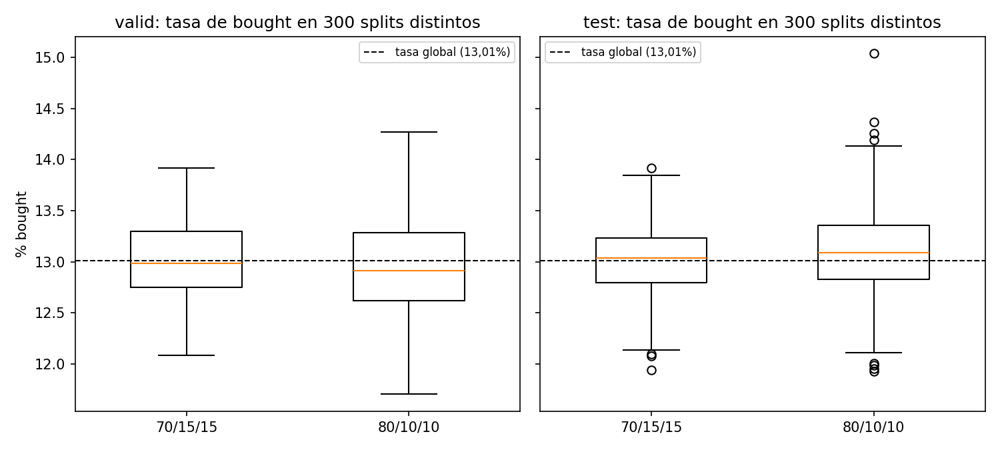
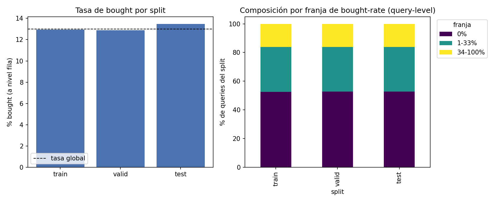
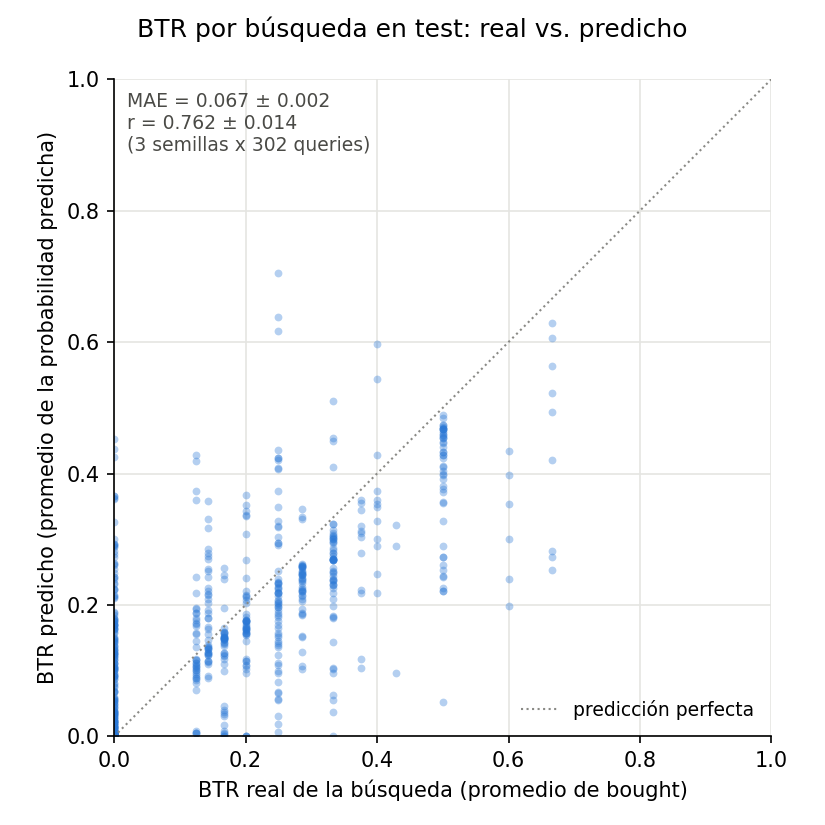

# Presentación — Ejercicio 2 (Desarrollo del sistema)

Contenido fuente para armar las diapositivas. Cada `##` es una diapositiva (o el bloque mínimo de una); dentro de cada una, los campos en negrita (**Qué cambiamos**, **Por qué**, etc.) son el guión de lo que se dice, no necesariamente texto literal para pegar en la slide.

Fuente de cada dato: [`Notas.md`](Notas.md) y [`Experimentos.md`](Experimentos.md) de este mismo directorio, más [`../ejercicio1/Notas.md`](../ejercicio1/Notas.md) para lo que viene del EDA. No hay ningún número o afirmación acá que no esté en esos documentos.

**Convención de este documento**: cuando una decisión no tiene una justificación sólida detrás (ni teórica de clase, ni experimental con datos propios), se marca explícitamente con **⚠ Sin justificar** en vez de inventar una razón. Aparecen varias — es información real para la defensa, no un error a esconder.

---

## Índice

1. Objetivo del Ejercicio 2 y alcance de esta presentación
2. Split train / valid / test
3. Cómo evaluamos los modelos (métricas)
4. Metodología del estudio de experimentos
5. Arquitectura general del sistema
6. Setup de entrenamiento (parámetros fijos)
7. Experimentos 1 a 11 (evolución paso a paso)
8. Comparación final y elección del modelo
9. Evaluación en test
10. Decisiones sin justificación completa (honestidad sobre lo que falta)

---

## 1. Objetivo y alcance

- Ejercicio 2 pide **diseñar e implementar un sistema** que prediga el Buy Through Rate (BTR), incluyendo **al menos un modelo Transformer**, con split train/valid/test, diseño de experimentos (arquitectura chica primero, `d_model < 100`) y un **estudio de ablación** de los módulos de la arquitectura.
- La variable objetivo real que se predice es `bought` a nivel fila (definido en el Ejercicio 1); el BTR de una búsqueda sale de promediar `bought`/las probabilidades predichas agrupando por `query_id`.
- **No se buscó un modelo de referencia por fuera del Transformer** (ej. regresión logística sobre las tabulares) para comparar contra un baseline clásico. **⚠ Sin justificar / no hecho**: no hay una comparación documentada contra un modelo no-Transformer; toda la evolución que sigue es dentro de la misma familia de arquitectura (Encoder-only de texto + rama tabular), exigida igual por la consigna.
- Tampoco se corrió, como experimento numerado propio, la variante "solo tabular, sin el bloque Transformer" — quedó identificada como un dial de ablación posible en `Notas.md` pero no se ejecutó de forma aislada. Lo más cercano es la comparación "solo texto" vs. "texto + tabular" (Experimentos 4/6 vs. 7), que sí está corrida.

---

## 2. Split train / valid / test

**Por qué agrupar por `query_id` y no por fila suelta:** cada búsqueda trae varios productos que comparten condiciones de búsqueda exactas (`filter_category`, `filter_storage_type`, `filter_price_min`, `filter_price_max` — confirmados constantes dentro de cada `query_id`). Si se particiona fila por fila, esas filas no son observaciones independientes entre sí — comparten esos filtros exactos y compitieron por el mismo usuario/momento de búsqueda. Repartirlas entre train y test podría inflar la métrica por esa correlación puntual entre filas "hermanas", no por generalización real. Por eso la partición mueve **todas las filas de una `query_id` juntas** al mismo split.

**Qué es exactamente una `query_id` — supuesto declarado, no un hecho cerrado del dataset.** Consultado en la clase de consultas con la cátedra (`consultas.VTT`): una misma `query_id` puede tener timestamps separados por hasta ~2 años entre sí — **confirmado en el dataset real: 2011 de las 2012 queries tienen más de un timestamp distinto entre sus propias filas** (ej. `q_000001` con filas de 2024, 2025 y 2026). La cátedra aclaró que no hay una única interpretación correcta de qué representa `query_id` — puede leerse como un contexto de búsqueda reutilizado históricamente (un historial de usuario a lo largo del tiempo), no necesariamente como "una búsqueda puntual en un instante". Pidió explícitamente que cada grupo declare su propia interpretación como **supuesto de implementación**. **Supuesto adoptado**: `query_id` se usa como clave de agrupación de condiciones de búsqueda compartidas, sin asumir que representa un evento puntual — `timestamp` no se usa ni para agrupar ni como feature.

**Agrupar por `query_id` para el split, confirmado por la cátedra, no solo argumento propio**: en la misma clase, ante la pregunta de cómo particionar para evitar que una búsqueda ya vista en train reaparezca en test, la respuesta textual de la cátedra fue agrupar por `query` "para no tener leak" — ofrecido como opción válida.

**Lo que no se hizo, declarado como simplificación consciente: partición temporal.** También se preguntó puntualmente qué tan grave sería no particionar train/valid/test por fecha. Respuesta de la cátedra: en un caso real de producción correspondería partir por tiempo (train con un intervalo, valid con otro, test con el más nuevo) — mezclar fechas puede inflar métricas por casualidad (efectos estacionales, ej. Navidad o día de la madre) en vez de medir generalización real. Para este TP aclaró explícitamente que **no es necesario y no penaliza** (el dataset abarca ~2 años, no un histórico muy profundo), pero pidió declararlo como simplificación a propósito. Por eso queda anotado acá: **no se particionó por `timestamp`**, solo por `query_id`.

**Por qué 3 particiones:**
- **train**: ajusta los pesos del modelo.
- **valid**: compara configuraciones durante todo el estudio de experimentos — es la métrica que se mira para decidir cada cambio de arquitectura.
- **test**: se toca **una sola vez**, al final, para el número que se reporta. Si se usara valid para elegir la mejor configuración *y* para reportar el resultado final, el número quedaría inflado por sobreajuste a valid.

**Proporciones: 70/15/15.** Trade-off considerado:
- A favor de train grande: el dataset es chico (2012 queries, 10.000 filas) y `bought` está desbalanceado (13%) — más train da más ejemplos positivos reales.
- A favor de valid/test más grandes: con splits chicos (~10%), el PR-AUC medido puede fluctuar bastante por azar — y como valid se consulta una vez por cada configuración del estudio, un valid ruidoso puede llevar a elegir la configuración que ganó por casualidad, no la que generaliza mejor.
- Se priorizó confiabilidad de la métrica sobre maximizar train.

**Por qué 70/15/15 y no 80/10/10 — comparación con datos reales, no solo argumento teórico:** se recalculó qué tamaño le tocaría a cada split bajo ambas proporciones, con la misma lógica de agrupación/estratificación (mismo `random_state=42`):

| proporción | split | n queries | n filas | n positivos (`bought`) |
|---|---|---|---|---|
| 70/15/15 | valid | 302 | 1498 | 193 |
| 70/15/15 | test | 302 | 1490 | 201 |
| 80/10/10 | valid | 201 | 1011 | 140 |
| 80/10/10 | test | 202 | 956 | 123 |

Con 80/10/10, test quedaría con 956 filas y 123 positivos — del mismo orden que los grupos de `country_of_origin` (245-331 filas) donde ya se había visto que 2-3 puntos de diferencia eran puro ruido. Con 70/15/15, test tiene 201 positivos (+56% frente a 80/10/10) para estimar PR-AUC con menos ruido, y valid (el split que se consulta una vez por cada configuración de los 11 experimentos) tiene 193 positivos (+38% frente a 80/10/10).

**Cuidado con juzgar esto por una sola corrida.** Con la semilla fija (`random_state=42`) que usa todo el estudio, la tasa de bought de test da 13,49% con 70/15/15 pero 12,87% con 80/10/10 — a primera vista, más cerca de la tasa global (13,01%) con el split *más chico*. Con una sola muestra no se puede distinguir si eso es un patrón real o la misma casualidad que motiva todo este análisis (ver sección de métricas). Por eso se repitió el split real **300 veces con semillas distintas**, midiendo qué tan lejos queda la tasa de bought de valid/test respecto de la tasa global en cada corrida:

| proporción | distancia promedio a la tasa global — valid | distancia promedio — test |
|---|---|---|
| **70/15/15** | **0,32 puntos** | **0,28 puntos** |
| 80/10/10 | 0,40 puntos | 0,35 puntos |

Con 300 corridas, **70/15/15 gana en promedio en valid y en test** — la corrida puntual de la semilla 42 donde test parecía irle mejor a 80/10/10 era la excepción, no el patrón general (ilustra exactamente el punto: una sola muestra puede engañar). Se ve también en la dispersión de resultados:

**Lo que sigue sin correrse**: el equivalente con el modelo entrenado (comparar cuánto varía el PR-AUC de valid entre corridas de cada proporción, no solo la tasa de bought) — esta comparación de tamaño y estabilidad es evidencia real a favor de 70/15/15, pero no reemplaza esa validación más completa con el modelo real.

**Estratificación**: por tasa de `bought` a nivel query, agrupada en 3 franjas (`0%`, `1-33%`, `34-100%`) — la tasa exacta no sirve como clase porque hay valores con muy pocas queries. Split en 2 pasos con `train_test_split(..., stratify=...)`, `random_state=42`.

| split | n queries | n filas | tasa de bought |
|---|---|---|---|
| train | 1408 | 7012 | 12,94% |
| valid | 302 | 1498 | 12,88% |
| test | 302 | 1490 | 13,49% |

Las 3 tasas quedan dentro de ±0,5 puntos porcentuales de la tasa global (13,01%) — la estratificación funcionó, y se mantiene igual de pareja al mirar la composición por franja de bought-rate y los tamaños de cada split (`output/split_balance.png`, 4 paneles):

**Todo el preprocesamiento (vocabulario, categorías de one-hot, media/desvío de z-score) se ajusta solo con train** y se aplica igual a valid/test, para no filtrar información de valid/test al preprocesamiento (leakage indirecto).

---

## 3. Cómo evaluamos los modelos

La consigna pide evaluar con **PR-AUC y ROC-AUC**, aclarando explícitamente que **no hace falta definir un threshold** — no interesa una decisión sí/no con un corte fijo, sino qué tan bien el modelo *ordena* los productos por probabilidad de compra.

### PR-AUC (área bajo la curva Precisión-Recall)

- **Precisión**: de los productos que el modelo marca como "probablemente comprados", cuántos realmente se compran. Fórmula: `Precisión = TP / (TP + FP)` (verdaderos positivos sobre todo lo que el modelo marcó como positivo).
- **Recall**: de los productos que realmente se compran, cuántos el modelo logra identificar. Fórmula: `Recall = TP / (TP + FN)` (verdaderos positivos sobre todos los que realmente eran positivos).
- Hay un trade-off entre ambas según qué tan exigente se sea; PR-AUC resume ese trade-off en un solo número, evaluando todos los cortes posibles a la vez (por eso no hace falta fijar un threshold).
- **PR-AUC en sí no tiene una fórmula cerrada simple**: es el área bajo la curva que se traza calculando (Precisión, Recall) en cada threshold posible entre 0 y 1 — se calcula numéricamente (ej. la función `average_precision_score` de sklearn), no con una cuenta de una línea.
- **Cómo se interpreta**: más cerca de 1 es mejor. El punto de comparación relevante **no es 0** sino la **prevalencia de la clase positiva** (13,01% acá) — es lo que daría un modelo que ignora completamente el input y ordena al azar.
- **Por qué se usa como métrica principal acá**: `bought` está desbalanceado (13% positivos, 87% negativos). Con muchos negativos "fáciles" de acertar, otras métricas pueden verse artificialmente buenas sin que el modelo realmente distinga bien la clase minoritaria. PR-AUC no tiene ese problema porque no le da crédito por acertar negativos.

### ROC-AUC (área bajo la curva ROC)

- Compara **tasa de verdaderos positivos** (`TPR = TP / (TP + FN)`, en realidad lo mismo que el Recall de arriba, con otro nombre) contra **tasa de falsos positivos** (`FPR = FP / (FP + TN)`, qué fracción de los que NO se compraron el modelo marcó igual como positivos) en todos los cortes posibles.
- **Tampoco tiene una fórmula cerrada simple**: es el área bajo la curva (TPR, FPR) trazada variando el threshold — mismo tipo de cálculo numérico que PR-AUC (`roc_auc_score` en sklearn), no una cuenta de una línea.
- **Cómo se interpreta**: equivale a la probabilidad de que, tomando un producto comprado y uno no comprado al azar, el modelo le dé mayor probabilidad al comprado. 0,5 = azar, 1,0 = perfecto.
- **Por qué se usa igual, como métrica secundaria**: la pide la consigna, y es útil como chequeo cruzado — pero con este desbalance puede verse alto (0,94-0,97 en casi todos los experimentos) sin que eso implique que el modelo separa bien la clase minoritaria, porque hay tantos negativos que la tasa de falsos positivos se mantiene baja casi sin esfuerzo. Por eso PR-AUC es el número que se mira primero para decidir entre configuraciones, y ROC-AUC se reporta como confirmación adicional.

### Gap de PR-AUC (train − valid): diagnóstico de sobreajuste

En cada época se mide PR-AUC tanto en train (en modo evaluación, sin dropout) como en valid. La diferencia entre ambos es el indicador de **overfitting** usado en todo el estudio: un gap chico y estable indica que el modelo generaliza; un gap que crece indica que está memorizando patrones específicos de train que no sirven en datos nuevos.

### Promedio sobre varias semillas

Cada configuración se corrió con **3 semillas (0, 1, 2)** y se reporta **media ± desvío estándar** — con un dataset chico, una sola corrida puede ganar o perder por la inicialización aleatoria, no por la arquitectura en sí, así que promediar varias corridas da una comparación más confiable entre configuraciones (esto además coincide con la recomendación de la clase de no reportar una sola ejecución). El desvío estándar entre semillas también se usa para decidir si una diferencia entre configuraciones es señal real o ruido (ej. gaps de 0,02-0,03 se consideran dentro del ruido cuando el desvío ronda ese mismo orden).

### Selección de "mejor época" por semilla

Para cada semilla se elige la época con mayor PR-AUC de valid (no la última época) como el resultado de esa corrida — evita reportar un punto ya sobreajustado si el entrenamiento siguió después del pico de generalización.

---

## 4. Metodología del estudio de experimentos

- **Arrancar chico**: con un dataset chico (10.000 filas, 2012 queries) y desbalanceado, un modelo grande desde el arranque arriesga sobreajustar sin poder distinguir si el problema es la arquitectura o la falta de datos — por eso `d_model < 100` en todos los experimentos, empezando por el valor más chico posible y subiendo de a poco (coincide con lo que sugiere la consigna, pero la razón de fondo es esta).
- **Diales de ablación**: `n_heads`, `n_layers`, `d_model` y la dimensión del feed-forward son los hiperparámetros que directamente controlan cuánta capacidad tiene el Encoder y cómo se reparte — son los candidatos naturales para un estudio de ablación de esta arquitectura (y coincide con lo que la clase nombra explícitamente para un Encoder, `transformers.VTT`). A esto se suman diales propios del problema: presencia de features tabulares dudosas (`country_of_origin`, `nutrition_score`), ancho de la cabeza de salida, positional encoding.
- **Cambio de metodología a partir del Experimento 3**: búsqueda **greedy / coordinate-ascent** — cada dial nuevo se prueba sobre la mejor configuración encontrada hasta el momento, no aislado contra la base fija del Experimento 1. Es más rápido y da directamente una arquitectura final, a costa de que los diales ya no quedan perfectamente aislados entre sí (si el mejor valor de un dial dependiera de cómo estaban fijados los otros en ese momento, no se llega a ver). **Trade-off consciente entre rigurosidad y tiempo disponible** — se declara así, no se esconde.
- **Separación cómputo/gráficos**: cada experimento guarda resultados crudos en CSV; los gráficos se generan en scripts separados que solo leen esos CSV, nunca reentrenan.

---

## 5. Arquitectura general del sistema

**Encoder-only para el texto (`title` + `description`).** Un Encoder tiene 2 partes: atención multi-cabeza sobre la secuencia de palabras (con conexión residual y normalización) y una red feed-forward posición a posición (también con residual y normalización). Se decidió Encoder-only y no Decoder-only ni Encoder-Decoder porque no hace falta *generar* texto ni traducir una secuencia a otra — hace falta *resumir/entender* el texto completo, que ya está disponible entero al momento de predecir (no hay nada "futuro" que enmascarar, a diferencia de un Decoder autoregresivo).

**Texto y datos tabulares se combinan recién al final**, cada uno por su rama, y se concatenan antes de la capa de salida — no se mete lo tabular dentro del Transformer como si fuera "un token más". Razones:
- Permite una ablación limpia: sacar el Transformer es desconectar una rama entera, no rediseñar la arquitectura.
- El texto tiene una estructura de orden/contexto que justifica usar atención; lo tabular no tiene esa estructura secuencial, no hay razón para forzarlo por atención.
- Deja al Transformer acotado a donde se había encontrado evidencia concreta de señal: el tag de reputación embebido en `title` (hallazgo del EDA del Ejercicio 1, confirmado luego en el Experimento 1).

**Confirmado con datos, no solo en teoría** (Experimentos 7, 8 y 10): con una cabeza de salida lineal simple, el sistema completo no superó al Transformer de texto solo — el problema no era la combinación en sí, sino que una capa lineal no puede aprender una interacción entre lo que dice el texto y lo que dicen las tabulares. Agregando una capa oculta a la cabeza, el resultado mejoró de forma clara. Ver el detalle en los Experimentos 7-10 más abajo.

---

## 6. Setup de entrenamiento (parámetros fijos)

Antes de entrar a los experimentos: estos son los valores que se usaron **igual en las 11 corridas** del estudio de ablación — no son "diales" que se hayan ido variando, son la base común sobre la que se compara cada cambio de arquitectura. Se agrupan acá para no repetirlos en cada experimento.

| parámetro | valor | fijo desde |
|---|---|---|
| Optimizador | Adam | Experimento 1 |
| Learning rate | `lr=1e-3` | Experimento 1 |
| Batch size | 128 | Experimento 1 |
| Semillas | 0, 1, 2 (siempre las mismas 3) | Experimento 1 |
| Dropout | 0,1 | Experimento 1 |
| Épocas | 20 (con una excepción puntual, ver abajo) | Experimento 1 |
| Vocabulario de texto | 412 tokens (410 palabras + `<PAD>` + `<UNK>`) | Ejercicio 1 |
| Largo de secuencia | `MAX_LEN=45` | Ejercicio 1 |

**Por qué estos quedaron fijos y no se convirtieron en diales de ablación — decisión de alcance del grupo, no solo comodidad.** Con el tiempo disponible, el grupo decidió concentrar el estudio de ablación en los diales que efectivamente definen la arquitectura del Transformer y su capacidad (heads, layers, `d_model`, dimensión del feed-forward — ver sección 4), en vez de repartir ese tiempo también entre hiperparámetros de entrenamiento estándar (optimizador, learning rate, batch size, dropout) que no son específicos de esta arquitectura y para los que existen defaults razonables ampliamente usados en la práctica. Esta priorización coincide con lo que la cátedra remarcó en la clase de consultas (`consultas.VTT`) sobre mantener el foco en el Transformer y evitar "meterse en algún rabbit hole" probando de más: *"no se rebusquen tanto... el foco está en que sepan dónde enchufar el Transformer y que entiendan esa arquitectura"* — pero la priorización en sí es una decisión del grupo, no una instrucción que se siguió a ciegas. Los valores puntuales elegidos, de todos modos, siguen sin tener un experimento propio detrás (ver más abajo).

**Lo que sí tiene justificación puntual:**
- **Semillas fijas (0, 1, 2) en todos los experimentos, no "alguna semilla" distinta cada vez**: así los experimentos quedan comparables entre sí — si cada uno usara semillas distintas, una diferencia de resultado podría deberse a qué semillas tocaron, no al cambio de arquitectura. Usar siempre las mismas 3 aísla esa fuente de variación del efecto que realmente se quiere medir.
- **20 épocas como default, confirmado después con datos**: el Experimento 8 corrió puntualmente también con 40 épocas para chequear si convenía entrenar más — se confirmó que no, la ganancia era chica y venía de picos puntuales de alguna semilla, no de una mejora sostenida (ver Experimento 8). El default de 20 no quedó sin chequear del todo, se validó una vez con evidencia.
- **Vocabulario y `MAX_LEN` heredados del Ejercicio 1**: ya estaban justificados ahí (tokenización por palabra en vez de BPE, por vocabulario chico y cerrado — ver `ejercicio1/Notas.md`), no son una decisión nueva de este ejercicio.

**⚠ Sin justificar del todo — trade-off no explorado**: los valores puntuales de Adam / `lr=1e-3` / `batch_size=128` / `dropout=0,1` nunca se compararon contra alternativas — son defaults razonables de la práctica común, no una elección respaldada por un experimento propio ni prescripta por el material de cátedra. Tampoco se probó si usar más de 3 semillas cambiaría las conclusiones de forma notable — es el mismo tipo de trade-off tamaño-vs-ruido que se discutió para el tamaño del split (sección 2), aplicado acá a la cantidad de semillas: 3 alcanza para no depender del resultado de una sola inicialización aleatoria (que puede ganar o perder por azar, como se explica en la sección de métricas), pero no se sabe si 5 o 10 semillas mostrarían más o menos variabilidad de la que ya se ve.

---

## Experimento 1 — Transformer de texto puro, config mínima

**Qué cambiamos:** punto de partida. Solo `title`+`description` a través de un Transformer Encoder-only — sin ninguna feature tabular todavía, para aislar el comportamiento del Transformer antes de complicar la arquitectura.

**Qué queríamos probar y por qué:** si hay señal real aprovechable en el texto solo, antes de invertir en la fusión con lo tabular. El EDA del Ejercicio 1 había encontrado un tag de reputación entre paréntesis en `title` con una relación muy fuerte con `bought` (67% vs. 0% según el tag) — la pregunta era si el Transformer podía capturarlo.

**Justificación teórica:**
- `d_model=16`: bien por debajo de 100 (consigna) y del vocabulario (412 tokens) — fuerza a comprimir agresivamente.
- `n_heads=1`: el mínimo que sigue siendo atención multi-cabeza; se deja explícitamente afuera de este experimento para aislarlo después.
- `n_layers=1`: la unidad más chica que la clase define como "Encoder".
- Positional encoding senoidal: se eligió esta variante en vez de, por ejemplo, un embedding de posición aprendido, porque no agrega parámetros nuevos al modelo (es una función fija, no una tabla que se entrena) — coherente con el criterio de "arrancar chico" del resto de la arquitectura. Es además la variante explicada en la Clase 1 para el Transformer original.
- **Pooling (mean-pooling sobre tokens no-pad): ⚠ Sin justificar del todo.** No está enseñado tal cual en el material (ni `[CLS]` ni mean-pooling aparecen como técnica de pooling para clasificación). Se apoya en una idea que sí se explicó en clase — la atención descrita como un promedio ponderado de tokens — usando pesos uniformes como caso particular de esa misma idea. Es un argumento razonable, pero no es "lo que dice la cátedra", y se declara así.
- Cabeza de salida `Linear(16→1)` directa: la versión más mínima posible, coherente con "arrancar chico".

**Configuración de entrenamiento:** Adam (`lr=1e-3`), `batch_size=128`, 20 épocas, 3 semillas. **⚠ Sin justificar**: no hay una comparación documentada de por qué Adam, por qué `lr=1e-3` o por qué `batch_size=128` — son los valores de partida usados en todo el estudio, sin un barrido propio.

**Resultados** (media ± std sobre 3 semillas, mejor época):

| valid PR-AUC | valid ROC-AUC | gap PR-AUC | n_params |
|---|---|---|---|
| 0,688 ± 0,024 | 0,954 ± 0,012 | 0,058 ± 0,049 | 9.889 |

**Interpretación:** hay señal fuerte en el texto solo — 0,688 está muy por encima de 0,130 (prevalencia de `bought`). Hay overfitting leve pero muy desigual entre semillas (gap de 0,114 en una semilla vs. 0,02-0,04 en las otras dos) — con un modelo tan chico y un dataset chico, 20 épocas ya alcanzan para sobreajustar en al menos una corrida.

**Decisión y por qué:** el modelo mínimo funciona y confirma la hipótesis del EDA — vale la pena seguir ablacionando desde acá en vez de agrandar todo de una.

**Motivó el siguiente experimento:** subir `n_heads` de 1 a 2, manteniendo todo lo demás igual, para aislar el efecto de repartir la atención en más de una cabeza sin mezclarlo con un cambio de capacidad (`d_model`) o profundidad (`n_layers`).

---

## Experimento 2 — `n_heads`: 1 → 2

**Qué cambiamos:** `n_heads=2`, con `d_model=16` sin cambios (se reparte en 2 subespacios de 8 dimensiones en vez de uno de 16).

**Qué queríamos probar y por qué:** si separar distintos "tipos" de relación entre palabras ayuda a capturar mejor la señal, o si con un texto tan corto (máximo 45 tokens, vocabulario de 410 palabras) un solo head ya alcanza.

**Justificación teórica:** las proyecciones Q/K/V/salida de la atención tienen tamaño `d_model × d_model` sin importar en cuántos heads se reparta esa dimensión — por eso el conteo de parámetros no cambia entre este experimento y el anterior (9.889 en ambos). `n_heads` reparte capacidad ya existente, no agrega parámetros nuevos.

**Resultados:**

| | Exp. 1 (`n_heads=1`) | Exp. 2 (`n_heads=2`) |
|---|---|---|
| valid PR-AUC | 0,688 ± 0,024 | 0,688 ± 0,007 |
| valid ROC-AUC | 0,954 ± 0,012 | 0,957 ± 0,004 |
| gap PR-AUC | 0,058 ± 0,049 | 0,082 ± 0,015 |

**Interpretación:** la performance pico no cambió (0,688 en ambos) — coherente con que `n_heads` no agrega capacidad, solo reparte la que ya había. Lo que sí cambió es la **estabilidad**: el desvío estándar entre semillas bajó de 0,024 a 0,007. Hipótesis (no confirmada del todo, con solo 3 semillas): con un único head, la inicialización aleatoria de esos mismos parámetros puede caer en soluciones más o menos afortunadas; con 2 heads, forzar una partición en subespacios más chicos reduce esa variabilidad.

**Decisión y por qué:** en este rango de `d_model`, `n_heads` no es el cuello de botella de performance — es más un dial de estabilidad de entrenamiento que de capacidad.

**Motivó el siguiente experimento:** en vez de seguir aislando un dial a la vez contra la base fija, se decidió pasar a un barrido de varios valores por dial y quedarse con el mejor (metodología greedy, ver sección 4) — empezando por `n_layers`.

---

## Experimento 3 — barrido de `n_layers`: 1 / 2 / 4 / 8

**Qué cambiamos:** cantidad de encoders apilados, manteniendo `n_heads=1`, `d_model=16`, `dim_feedforward=64`.

**Qué queríamos probar y por qué:** apilar capas es distinto de agregar heads — cada capa nueva suma un set completo de proyecciones Q/K/V/salida y feed-forward propio (no reparte, agrega). Se esperaba que esto sí moviera tanto la capacidad como el riesgo de overfitting.

**Justificación teórica:** se probó una progresión de duplicado desde la base (1 → 2 → 4 → 8) para ver la tendencia a lo largo de un orden de magnitud de profundidad sin correr un barrido exhaustivo — coincide además con los valores que la clase menciona explícitamente para esta variable (paper original: 6 capas, "prueban 2/4/8 también").

**Resultados:**

| `n_layers` | n_params | valid PR-AUC | valid ROC-AUC | gap PR-AUC |
|---|---|---|---|---|
| 1 | 9.889 | 0,688 ± 0,024 | 0,954 ± 0,012 | 0,058 ± 0,049 |
| **2** | 13.169 | **0,696 ± 0,018** | 0,953 ± 0,012 | **0,028 ± 0,042** |
| 4 | 19.729 | 0,651 ± 0,025 | 0,950 ± 0,006 | 0,065 ± 0,032 |
| 8 | 32.849 | 0,650 ± 0,053 | 0,947 ± 0,009 | 0,055 ± 0,035 |

**Interpretación:** `n_layers=2` gana en PR-AUC **y** generaliza mejor (gap más chico de los 4 valores) — mejora en dos frentes a la vez, no solo el número más alto por casualidad. Más profundidad no ayudó, de hecho empeoró: con un dataset chico (7.012 filas de train) y secuencias cortas, apilar más encoders agrega parámetros sin que haya más señal para aprovecharlos, y el modelo se vuelve más difícil de optimizar de forma estable en pocas épocas.

**Decisión y por qué:** `n_layers=2` queda fijo. Arquitectura base para seguir: `n_heads=1, n_layers=2, d_model=16, dim_feedforward=64`.

**Motivó el siguiente experimento:** quedan dos diales de capacidad por explorar — `d_model` (ancho general del modelo) y `dim_feedforward` (ancho del MLP interno de cada encoder). Se decidió correrlos **por separado** primero (Experimentos 4 y 5), para no mezclar sus efectos, dejando la posibilidad de combinarlos después si la evidencia lo pedía.

---

## Experimento 4 — barrido de `d_model`: 8 / 16 / 32 / 64 / 128 / 256

**Qué cambiamos:** `d_model`, con `dim_feedforward=64` fijo y la base ganadora del Experimento 3 (`n_heads=1, n_layers=2`). Primera tanda: 8, 16, 32, 64 (dentro de "`d_model<100`", la sugerencia de la consigna para arrancar). **Segunda tanda: 128 y 256** — se extendió el barrido más allá de 100 porque la primera tanda no mostraba meseta y "`d_model<100`" es una guía de punto de partida, no un techo (la clase lo dice explícitamente: *"arranquen con menos de 100... de última después van aumentando"*, `consigna.VTT`) — correspondía seguir buscando el techo real en vez de frenar ahí.

**Qué queríamos probar y por qué:** si el modelo venía corto de capacidad de representación en `d_model=16`, y dónde está el techo real de este dial.

**Resultados:**

| `d_model` | n_params | valid PR-AUC | valid ROC-AUC | gap PR-AUC |
|---|---|---|---|---|
| 8 | 6.137 | 0,665 ± 0,016 | 0,947 ± 0,003 | 0,004 ± 0,039 |
| 16 | 13.169 | 0,696 ± 0,018 | 0,953 ± 0,011 | 0,028 ± 0,042 |
| 32 | 30.305 | 0,710 ± 0,022 | 0,964 ± 0,001 | 0,044 ± 0,047 |
| **64** | 76.865 | **0,724 ± 0,021** | 0,962 ± 0,004 | 0,012 ± 0,014 |
| 128 | 219.137 | 0,718 ± 0,031 | 0,962 ± 0,004 | 0,081 ± 0,063 |
| 256 | 700.289 | 0,708 ± 0,014 | 0,962 ± 0,002 | -0,014 ± 0,008 |

**Interpretación:** con el barrido completo, `d_model=64` queda confirmado como el techo real — no era un límite artificial de la consigna. La primera tanda (8 a 64) subía de forma monótona sin meseta, lo que hacía pensar que el techo estaba más allá; con 128 y 256 aparece un **pico interior**: PR-AUC baja en los dos (0,718 y 0,708, contra 0,724 en 64). En `d_model=128` el gap de overfitting se dispara (0,081, el más alto de todo el barrido, con mucha variabilidad entre semillas) — 219.137 parámetros, 31x las 7.012 filas de train, sin señal real adicional que aprovechar. En `d_model=256` el gap da directamente negativo (-0,014) — con 700.289 parámetros (100x las filas de train) el modelo ni siquiera llega a ajustar bien train en 20 épocas, más indicio de necesitar muchas más épocas para converger que de generalizar mejor. ROC-AUC se mantiene prácticamente plano (0,962) en 64/128/256 — la señal clara está en PR-AUC, no ahí.

**Decisión y por qué:** `d_model=64` queda fijo — confirmado con datos como el mejor valor de todo el rango explorado (8 a 256), no solo el mejor dentro de un límite autoimpuesto.

**Motivó el siguiente experimento:** correr `dim_feedforward` por separado (Experimento 5), manteniendo `d_model=16` (la base anterior, no la nueva ganadora) para no mezclar ambos efectos todavía.

---

## Experimento 5 — barrido de `dim_feedforward`: 16 / 32 / 64 / 128 / 256 / 512

**Qué cambiamos:** ancho del MLP interno de cada encoder, con `d_model=16` fijo. Primera tanda: 16, 32, 64, 128. **Segunda tanda: 256 y 512** — mismo criterio que la extensión del Experimento 4: la tanda original ya mostraba un pico interior en 64 con un solo punto de caída confirmándolo (128), así que se agregaron más puntos para confirmar la tendencia en vez de quedarse con la caída de un solo valor.

**Resultados:**

| `dim_feedforward` | n_params | valid PR-AUC | valid ROC-AUC | gap PR-AUC |
|---|---|---|---|---|
| 16 | 10.001 | 0,680 ± 0,051 | 0,954 ± 0,007 | 0,064 ± 0,044 |
| 32 | 11.057 | 0,674 ± 0,035 | 0,954 ± 0,007 | 0,063 ± 0,027 |
| **64** | 13.169 | **0,696 ± 0,018** | 0,953 ± 0,011 | 0,028 ± 0,042 |
| 128 | 17.393 | 0,688 ± 0,017 | 0,953 ± 0,006 | 0,049 ± 0,058 |
| 256 | 25.841 | 0,680 ± 0,005 | 0,951 ± 0,011 | 0,055 ± 0,023 |
| 512 | 42.737 | 0,675 ± 0,030 | 0,953 ± 0,008 | 0,060 ± 0,045 |

**Interpretación:** con el barrido completo, el pico interior en `dim_feedforward=64` (proporción 4x sobre `d_model=16`, la misma del paper original) queda confirmado, no es efecto de un solo punto — todos los valores por encima (128, 256, 512) quedan peor, estabilizándose entre 0,675-0,688 sin volver a mejorar. A diferencia del `d_model=256` del Experimento 4, acá no aparecen gaps raros ni señales de no-convergencia — los valores de overfitting se mantienen en un rango razonable en todo el barrido. Un feed-forward angosto es un cuello de botella; uno demasiado ancho agrega parámetros sin beneficio.

**Decisión y por qué:** queda planteada una tensión con el Experimento 4: ahí el `dim_feedforward=64` fijo mientras subía `d_model` terminó en una proporción real de 1x (no 4x) en el punto ganador (`d_model=64`), y aun así dio el mejor resultado hasta el momento. No se puede saber, sin correrlo, si la proporción 4x importa (y `d_model=64` con `dim_feedforward=256` daría más todavía) o si lo que importa es la capacidad absoluta de `d_model` y 64 ya alcanza como ancho de MLP.

**Motivó el siguiente experimento:** correr puntualmente `d_model=64` con `dim_feedforward` escalado a la proporción 4x, para resolver esa tensión sin correr un grid completo.

---

## Experimento 6 — ¿escalar `dim_feedforward` junto con `d_model`?

**Qué cambiamos:** dos combinaciones nuevas manteniendo la proporción 4x: `d_model=32` con `dim_feedforward=128`, y `d_model=64` con `dim_feedforward=256`. Comparadas contra las mismas filas de `d_model=32`/`64` del Experimento 4 (`dim_feedforward=64` fijo ahí).

**Resultados:**

| `d_model` | `dim_feedforward` | proporción | valid PR-AUC | gap PR-AUC |
|---|---|---|---|---|
| 32 | 64 | 2x | 0,710 ± 0,022 | 0,044 ± 0,047 |
| 32 | 128 | 4x | 0,713 ± 0,025 | 0,049 ± 0,004 |
| **64** | **64** | **1x** | **0,724 ± 0,021** | **0,012 ± 0,014** |
| 64 | 256 | 4x | 0,721 ± 0,025 | 0,099 ± 0,070 |

**Interpretación:** PR-AUC casi no cambia al escalar `dim_feedforward` en ninguno de los dos `d_model` (diferencias dentro del desvío estándar). Donde sí hay un efecto grande, y en la dirección contraria a lo esperado, es en el overfitting: en `d_model=64`, pasar de `dim_feedforward=64` a 256 casi octuplica el gap de generalización (0,012 → 0,099) — son 126.401 parámetros contra 7.012 filas de train, un orden de magnitud menor; el feed-forward más ancho agrega capacidad que el modelo termina memorizando, no aprovechando.

**Decisión y por qué:** gana la segunda hipótesis del Experimento 5 — la proporción 4x no se sostiene al escalar `d_model`, lo que pesa es la capacidad absoluta de `d_model`. Este dial queda cerrado en `d_model=64, dim_feedforward=64` (PR-AUC valid 0,724 ± 0,021, el mejor resultado de solo texto de todo el estudio).

**Motivó el siguiente experimento:** con `n_heads, n_layers, d_model, dim_feedforward` ya cerrados sobre el Transformer de texto puro, se pasó al sistema completo: texto + features tabulares combinadas.

---

## Experimento 7 — sistema completo: texto + tabular

**Qué cambiamos:** se agrega la rama tabular. El vector de 64 dimensiones que resume el texto (`TextEncoder`, ganador del Experimento 6) se concatena con el vector de 75 features tabulares ya codificadas (numéricas, one-hot, multi-hot de ingredientes), y el vector combinado (139 dimensiones) entra directo a una salida `Linear(139→1)`, sin capa oculta — mismo criterio minimalista de "arrancar chico" del Experimento 1, aplicado ahora al vector combinado.

**Qué queríamos probar y por qué:** si sumar la información tabular mejora sobre el texto solo, y si combinar recién en la última capa (en vez de dentro del Transformer) es suficiente para aprovecharla — la validación empírica pendiente de la decisión de arquitectura general (ver sección 5).

**Resultados:**

| | Solo texto (Exp. 4/6) | Texto + tabular (Exp. 7) |
|---|---|---|
| valid PR-AUC | **0,724 ± 0,021** | 0,718 ± 0,023 |
| valid ROC-AUC | 0,962 ± 0,004 | **0,967 ± 0,002** |
| gap PR-AUC | **0,012 ± 0,014** | 0,045 ± 0,024 |

**Interpretación — resultado contraintuitivo:** agregar lo tabular **no mejoró PR-AUC** (0,718 vs. 0,724, diferencia dentro del ruido). ROC-AUC sí mejoró (0,962 → 0,967) — las tabulares ayudan a ordenar mejor los casos en general, pero no a nivel de precisión sobre los candidatos más probables. El overfitting empeoró bastante (gap casi se cuadruplica) y aparece mucho antes en el entrenamiento. **Hipótesis**: la capa de salida es un solo `Linear` — puede aprender a pesar cada feature tabular por separado, pero no puede aprender una interacción entre "lo que dice el texto" y "lo que dicen las tabulares" (ej. que el tag de reputación importe más o menos según la categoría del producto). Eso requeriría una no-linealidad después de la concatenación, descartada acá por el mismo criterio minimalista de los experimentos anteriores.

**Decisión y por qué:** no se descarta lo tabular — se prueba primero si el problema es la capacidad de la cabeza de salida, antes de concluir que las tabulares no aportan.

**Motivó el siguiente experimento:** agregar una capa oculta a la cabeza de salida, para dar lugar a esa interacción no-lineal entre texto y tabular.

---

## Experimento 8 — capa oculta en la cabeza de salida

**Qué cambiamos:** cabeza `Linear(139→64) → ReLU → Dropout(0,1) → Linear(64→1)` en vez de `Linear(139→1)` directo. `hidden=64` iguala el ancho de la rama de texto (`d_model=64`).

**Justificación teórica:** se revisó si el material de cátedra prescribe alguna arquitectura de cabeza sobre un Encoder-only, y no aparece una — la clase solo menciona de pasada que un Transformer "puede ser clasificación también", y en `consigna.VTT` la respuesta del profesor a esta misma pregunta fue devolvérsela al grupo. `hidden=64` se eligió por paridad con `d_model`, no por una prescripción externa — es la elección de partida, después se pasa a barrer (Experimento 10).

**Resultados** (corrida extendida a 40 épocas para confirmar si convenía entrenar más, ver interpretación):

| | Solo texto | Sin capa oculta (Exp. 7) | Con capa oculta (Exp. 8) |
|---|---|---|---|
| valid PR-AUC | 0,724 ± 0,021 | 0,718 ± 0,023 | **0,798 ± 0,008** |
| valid ROC-AUC | 0,962 ± 0,004 | 0,967 ± 0,002 | **0,968 ± 0,003** |
| gap PR-AUC | 0,012 ± 0,014 | 0,045 ± 0,024 | 0,128 ± 0,021 |

**Interpretación:** confirma la hipótesis del Experimento 7 de forma contundente — la mejor marca de todo el estudio hasta este punto (0,798). El problema no era que las tabulares no aportaran, era que la cabeza lineal no podía aprovecharlas. Con 40 épocas se ve el techo que con 20 no se veía: valid sube fuerte hasta ~época 20-25 y ahí se aplana (incluso baja un poco hacia la 40), mientras train sigue subiendo hasta ~0,97 — la ganancia de entrenar más allá de 20-25 épocas es chica y viene de picos puntuales de alguna semilla, no de una mejora sostenida.

El gráfico lo muestra directo: el mejor PR-AUC de valid alcanzable con presupuesto de 20 épocas (0,791) y con 40 épocas (0,798) difieren solo 0,006 — la curva ya está prácticamente aplanada en la época 20, duplicar el entrenamiento no cambia la conclusión.

**Decisión y por qué:** arquitectura cerrada en `hidden=64`, con ~20-25 épocas como rango razonable — no hace falta ir a 40.

**Motivó el siguiente experimento:** con la arquitectura cerrada, se pasó a ablacionar dos features tabulares puntuales marcadas como "dudosas" desde el EDA por señal univariada débil: `country_of_origin` y `nutrition_score`.

---

## Experimento 9 — ablación de `country_of_origin` y `nutrition_score`

**Qué cambiamos:** 4 variantes, misma arquitectura y semillas que el Experimento 8, sacando columnas por prefijo: `full`, sin `country_of_origin`, sin `nutrition_score`, sin ambas.

**Qué queríamos probar y por qué:** el EDA del Ejercicio 1 no había encontrado señal univariada clara para ninguna de las dos (`country_of_origin`: rango de tasas 10,7%-16,6%, compatible con ruido dado el tamaño de cada grupo; `nutrition_score`: correlación prácticamente nula, -0,019). Quedaron marcadas como candidatas a ablación en vez de descartarse a ciegas, porque podían aportar en combinación con otras features aunque no univariadamente.

**Resultados:**

| variante | valid PR-AUC | gap PR-AUC |
|---|---|---|
| **full** | **0,791 ± 0,006** | 0,094 ± 0,030 |
| sin `country_of_origin` | 0,786 ± 0,012 | 0,090 ± 0,023 |
| sin ambas | 0,785 ± 0,012 | 0,076 ± 0,014 |
| sin `nutrition_score` | 0,760 ± 0,019 | 0,118 ± 0,032 |

**Interpretación:** `nutrition_score` sí aporta señal real — sacarla baja PR-AUC de forma consistente en las 3 semillas (-0,031 en promedio, grande frente al desvío de cada punto). `country_of_origin` no muestra evidencia clara — efecto mixto por semilla, caída promedio de solo 0,005, dentro del ruido. Hay un resultado raro anotado sin esconder: "sin ambas" queda mejor que "sin `nutrition_score`" sola, cuando lo esperable sería lo contrario — posible interacción entre ambas features, o ruido de tener solo 3 semillas por variante; no se puede distinguir con lo corrido, y no cambia la conclusión principal.

**Decisión y por qué:** `nutrition_score` se queda (evidencia consistente de aporte). `country_of_origin` queda como candidata a sacar del modelo final — no hay evidencia de que sume, y sacarla achica el modelo sin costo aparente.

**Motivó el siguiente experimento:** antes de cerrar la arquitectura, se volvió sobre un cabo suelto — `hidden=64` se había fijado probando un solo valor, no con un barrido como los demás diales de capacidad. Se decidió tratarlo como un dial más y barrerlo.

---

## Experimento 10 — barrido de `hidden` (ancho de la capa oculta de la cabeza)

**Qué cambiamos:** ancho de la capa oculta de la cabeza de salida, sobre la variante `full` del Experimento 9. `hidden=0` es "sin capa oculta" (Experimento 7).

**Resultados:**

| `hidden` | n_params | valid PR-AUC | valid ROC-AUC | gap PR-AUC |
|---|---|---|---|---|
| 0 | 76.940 | 0,718 ± 0,023 | 0,967 ± 0,002 | 0,045 ± 0,024 |
| 32 | 81.313 | 0,729 ± 0,005 | 0,968 ± 0,000 | 0,084 ± 0,010 |
| 64 | 85.825 | 0,791 ± 0,006 | 0,970 ± 0,002 | 0,094 ± 0,030 |
| 128 | 94.849 | 0,798 ± 0,007 | 0,971 ± 0,002 | 0,110 ± 0,007 |
| 256 | 112.897 | 0,816 ± 0,013 | 0,973 ± 0,002 | 0,111 ± 0,020 |
| **512** | 148.993 | **0,820 ± 0,007** | **0,975 ± 0,001** | 0,104 ± 0,003 |

**Interpretación:** con 512 recién aparece la meseta que en 256 no se veía — el incremento 128→256 fue +0,018; el de 256→512 es +0,004, un orden de magnitud más chico y dentro del solapamiento de los desvíos estándar. `hidden=512` es la mejor marca de todo el estudio, pero por un margen chico sobre 256 a cambio de 36.096 parámetros más (ya 21x las filas de train).

**Decisión y por qué:** se prioriza **`hidden=256`** sobre 512, por el mismo criterio de "arrancar chico" que guio todo el estudio — la diferencia de PR-AUC (0,004) no justifica duplicar el tamaño de la cabeza. `hidden=512` queda documentado como el punto de referencia que confirma dónde está la meseta real, no como la elección final.

**Motivó el siguiente experimento:** con la arquitectura del sistema completo cerrada de punta a punta, quedaban dos diales pendientes del Transformer de texto solo: positional encoding y pooling. Se priorizó positional encoding porque hay una hipótesis concreta y verificable para probar (si sacarlo afecta la capacidad del modelo de aprovechar el orden de las palabras — algo que además está desarrollado en clase); pooling quedó como default razonado sin experimento propio porque no hay una alternativa clara con la que compararlo desde el material del curso, y estructuralmente no se puede sacar del todo — alguna forma de reducir la secuencia a un vector es inevitable para clasificar.

---

## Experimento 11 — con/sin positional encoding

**Qué cambiamos:** se corre sobre el Transformer de **texto solo** (no el sistema completo), para aislar el efecto sin que las tabulares puedan compensar la pérdida de información de orden.

**Justificación teórica:** es el único dial de este bloque explicado explícitamente en clase — "lo hacés para darle un orden a tus tokens": sin él, la atención no distingue el orden de las palabras.

**Resultados:**

| variante | valid PR-AUC | train PR-AUC | gap PR-AUC |
|---|---|---|---|
| con positional encoding | 0,724 ± 0,021 | 0,736 | **0,012 ± 0,014** |
| sin positional encoding | 0,720 ± 0,001 | 0,893 | 0,174 ± 0,022 |

**Interpretación:** PR-AUC de valid casi no cambia (0,724 → 0,720) — sacar el positional encoding no le hace perder al modelo casi nada de capacidad de *alcanzar* un buen resultado en valid. Esto sorprende dado el hallazgo del tag de reputación en `title` (un patrón que parecía "posicional"), pero se explica porque ese patrón puede ser más una cuestión de qué palabras aparecen juntas (que la atención capta igual sin orden) que de en qué posición exacta aparecen. Donde sí hay un efecto enorme es en el overfitting: el gap se dispara de 0,012 a 0,174 — train llega a 0,89-0,92 sin positional encoding mientras valid queda prácticamente plano. **Hipótesis, no confirmada del todo**: sin información de orden, la atención solo agrupa por similitud de contenido, con menos restricción estructural — el positional encoding actuaría como una forma de regularización implícita, no solo como información de orden en sí.

**Decisión y por qué:** se mantiene en la arquitectura final — no tanto por el PR-AUC pico (que casi no cambia), sino porque sin él el modelo sobreajusta muchísimo más rápido y más fuerte, lo cual sería un problema real en un dataset todavía más chico o entrenando más épocas.

**Motivó el paso siguiente:** con los dos frentes pendientes del Transformer de texto resueltos, el paso que queda es evaluar en test, una sola vez, la configuración final completa.

---

## 8. Comparación final y elección del modelo

Evolución del PR-AUC de valid en los hitos principales del estudio (config ganadora en cada etapa, no todos los puntos del barrido):

| Etapa | Cambio clave | valid PR-AUC |
|---|---|---|
| Exp. 1 | Texto solo, config mínima | 0,688 |
| Exp. 3 | `n_layers`: 1 → 2 | 0,696 |
| Exp. 4/6 | `d_model`: 16 → 64 (cerrado) | 0,724 |
| Exp. 7 | + tabular, cabeza lineal | 0,718 (sin mejora) |
| Exp. 8 | + capa oculta en la cabeza (`hidden=64`) | 0,798 |
| Exp. 9 | ablación de features dudosas (`full` reentrenado) | 0,791 |
| Exp. 10 | `hidden`: 64 → 256 | **0,820** |
| Exp. 11 | confirma positional encoding (rama de texto sola) | 0,724 (sin cambio de headline) |

**Modelo final elegido**: `CombinedModel` con `n_heads=1, n_layers=2, d_model=64, dim_feedforward=64, hidden=256`, positional encoding senoidal, mean-pooling, todas las features tabulares menos `country_of_origin` (con `nutrition_score` incluida), ~20 épocas.

**Por qué esta y no otra de las configuraciones probadas:**
- Cada dial que compone esta arquitectura ganó su propio experimento con evidencia (PR-AUC de valid, y en varios casos también el gap de overfitting) contra al menos una alternativa concreta, no por default.
- Frente a la config mínima del Experimento 1 (0,688), la ganancia total es de +0,132 en PR-AUC de valid (+19% relativo) — y no viene de un solo cambio grande, sino de una cadena de decisiones cada una con su propia justificación: profundidad (`n_layers`), ancho (`d_model`), fusión con tabular + no-linealidad en la cabeza (el salto más grande, +0,074 al pasar de Exp. 7 a Exp. 8), ancho de esa cabeza, y una feature tabular descartada por falta de evidencia de aporte.
- Donde hubo margen chico entre dos opciones (`hidden=256` vs. `512`; `dim_feedforward` en dos proporciones distintas) se priorizó consistentemente el modelo más chico, siguiendo el criterio de "arrancar chico" de la consigna — no se persiguió el número más alto a cualquier costo de tamaño.
- **Trade-off explícito a mencionar en la presentación**: por la metodología greedy (sección 4), esta no es necesariamente *la* combinación óptima de todos los diales evaluados en conjunto — es la mejor encontrada bajo una búsqueda secuencial, dial por dial, sobre la mejor base de cada paso anterior.

---

## 9. Evaluación en test

**Configuración**: la ganadora de todo el estudio de ablación (Experimentos 1 a 11), evaluada **una sola vez** sobre `data/test.csv` — hasta este punto test no se había tocado, solo train/valid. Mismo criterio de selección de mejor época por semilla que en el resto del estudio; 3 semillas promediadas.

**Resultados a nivel fila (`bought`):**

| seed | mejor época (por valid) | test PR-AUC | test ROC-AUC |
|---|---|---|---|
| 0 | 16 | 0,806 | 0,962 |
| 1 | 13 | 0,813 | 0,966 |
| 2 | 15 | 0,809 | 0,967 |
| **media ± std** | — | **0,809 ± 0,003** | **0,965 ± 0,003** |

**Interpretación:**
- **Test confirma lo que decía valid, sin sorpresas.** 0,809 es prácticamente el mismo número que se venía viendo en valid en las épocas 13-16 (0,80-0,82 en el Experimento 10), y con la varianza más baja de todo el estudio (std 0,003). Es la mejor señal posible de que las decisiones de arquitectura tomadas en base a valid a lo largo de 11 experimentos no terminaron sobreajustadas a ese split en particular — si lo hubieran estado, test habría dado un número notablemente más bajo.
- **Resultado final: PR-AUC de test 0,809** (vs. 0,130 de prevalencia — el nivel de un modelo sin ninguna señal) **y ROC-AUC 0,965** (vs. 0,5 de azar).
- Mejora sustancial sobre el punto de partida del Experimento 1 (0,688 de PR-AUC en valid, con texto solo y config mínima) — el camino completo (heads → layers → `d_model` → `dim_feedforward` → fusión con tabular → capa oculta de la cabeza → ancho de esa capa → features dudosas → positional encoding) explica de punta a punta cómo se llegó de un punto a otro, con cada paso medido y justificado.

**BTR agregado por búsqueda — lo que realmente pide la consigna.** `bought` a nivel fila es la variable con la que se entrena y se mide PR-AUC/ROC-AUC (ver sección 3), pero el Ejercicio 2 pide predecir el BTR de una búsqueda, que es el promedio de `bought` (o de la probabilidad predicha) agrupando por `query_id` — un agregado que no se había calculado en ningún experimento anterior (1 a 11 miran solo la métrica a nivel fila). Se calculó sobre las mismas 3 corridas ya entrenadas (mismos pesos de la mejor época por semilla, sin reentrenar ni tocar test una segunda vez): se agrupan las predicciones de test por `query_id` y se compara el BTR real de cada búsqueda contra el promedio de las probabilidades predichas de sus filas.

| métrica (BTR por búsqueda, 302 queries de test) | media ± std (3 semillas) |
|---|---|
| MAE (error absoluto medio) | 0,067 ± 0,002 |
| Correlación de Pearson | 0,762 ± 0,014 |

**Interpretación:**
- El modelo agarra bien la tendencia general (r=0,76, se nota la nube de puntos subiendo de izquierda a derecha) y el error típico por búsqueda es chico en términos absolutos (MAE de 0,067, es decir ~7 puntos porcentuales).
- **Tiende a sobreestimar el BTR de las búsquedas con `bought` real muy bajo o cero** — se ve la columna de puntos en `btr_real=0` con predicciones dispersas hasta 0,3-0,45. Tiene sentido: el modelo se entrena a nivel fila (clasificar cada producto individual), no optimiza directamente para acertar el promedio agregado de una búsqueda — y varias queries de test tienen pocas filas, donde el promedio real es más sensible a un solo caso.
- La consigna aclara explícitamente que no hace falta que el BTR se prediga "perfecto" — se evalúa el abordaje y la iteración, no el resultado final en sí.

---

## 10. Decisiones sin justificación completa

Para que la defensa sea honesta sobre el alcance real del estudio — nada de esto se inventó como justificación, se deja marcado como lo que es:

- **Split 70/15/15**: respaldado con una comparación real de tamaños y de estabilidad (300 splits con semillas distintas) contra 80/10/10 (sección 2) — no es solo argumento teórico. Lo que sigue faltando es la validación con el modelo entrenado: comparar cuánto varía el PR-AUC de valid entre corridas de cada proporción, no solo la tasa de bought. Queda como trabajo pendiente si se quisiera cerrar del todo.
- **Adam, `lr=1e-3`, `batch_size=128`, `dropout=0,1`** (ver sección 6): usados en todo el estudio sin un barrido propio ni una comparación documentada contra alternativas — son valores de partida razonables, con la decisión de *no* barrerlos respaldada por la cátedra (foco en el Transformer, evitar rabbit holes), pero los valores puntuales en sí no tienen experimento propio.
- **Cantidad de semillas (3, siempre 0/1/2)**: alcanza para cumplir la recomendación de la cátedra de promediar corridas, pero no se probó si 5 o 10 semillas mostrarían más o menos variabilidad — mismo tipo de trade-off tamaño-vs-ruido que el del split (sección 2), sin explorar acá.
- **Mean-pooling sobre la salida del Encoder**: apoyado en una analogía razonable con algo visto en clase (atención como promedio ponderado), pero no es una técnica de pooling enseñada tal cual para este tipo de tarea. No se comparó experimentalmente contra otra alternativa de pooling.
- **`hidden=64` como punto de partida del Experimento 8**: elegido por paridad con `d_model`, antes de barrerlo en el Experimento 10 — la elección inicial en sí no tuvo más justificación que esa simetría.
- **Sin baseline no-Transformer**: no se corrió ni comparó un modelo tabular clásico (ej. regresión logística) como punto de referencia externo a la familia de arquitecturas exploradas.
- **Sin experimento aislado de "solo tabular, sin Transformer"**: identificado como dial de ablación posible, no ejecutado como corrida propia — lo más cercano es la comparación inversa (solo texto vs. texto+tabular, Exp. 4/6 vs. 7).
- **Metodología greedy desde el Experimento 3**: trade-off consciente y declarado entre rigurosidad del estudio de ablación y tiempo disponible — significa que no todos los diales quedaron perfectamente aislados entre sí a lo largo de todo el estudio.

---

## Cierre

Con esto se cierra el Ejercicio 2: arquitectura final justificada dial por dial, evaluación en test hecha una sola vez y consistente con lo visto en valid durante todo el estudio. Queda pendiente el Ejercicio 3 (personalización del BTR, teórico) — fuera del alcance de esta presentación.
